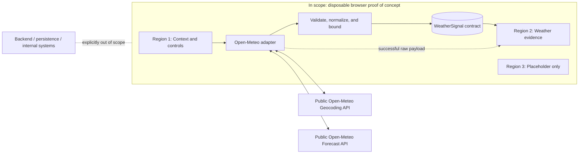

# ADR-001: Map Public Open-Meteo Data into a Bounded WeatherSignal Contract in a Disposable Browser Proof of Concept

**Status:** Proposed  
**Date:** 2026-07-21  
**Deciders:** Workshop participant and facilitator  
**Scope:** Weather app workshop slice only  
**Related spec:** `plans/spec_v1.md`

## Context

The workshop needs an inspectable browser application that fetches public weather data from Open-Meteo and demonstrates an explicit boundary between an external provider response and application-facing evidence. The artifact is disposable, uses plain HTML/CSS/JavaScript, and has no backend, database, authentication, analytics, deployment, or real operational integration.

Open-Meteo's geocoding and forecast response shapes are provider-owned. Rendering those fields directly throughout the UI would couple presentation to the provider, spread unit and null-handling assumptions across the page, and make the mapping lesson difficult to observe. Adding a backend would create an unnecessary deployment and operational boundary for this workshop phase.

The application must represent current conditions, the next 24 hours, and the next 7 days; retain raw source evidence separately; support deterministic fictional fallback; and prevent fallback from appearing as successful live evidence.

This ADR records a proposed workshop design only. It is not approved architecture or a production decision.

## Decision Drivers

- Make the external-to-internal data boundary visible and teachable.
- Keep Open-Meteo field names and response changes isolated.
- Bound the evidence to one current record, 24 hourly records, and 7 daily records.
- Preserve explicit units, null semantics, provenance, and source location.
- Keep raw evidence separate from mapped evidence.
- Support deterministic fictional fallback through the same consumer contract without mislabeling it as live.
- Avoid infrastructure and dependencies that do not serve the workshop goal.
- Remain testable with pure JavaScript functions.

## Decision

The browser will call Open-Meteo directly through a small API adapter and map each valid forecast response into an application-owned `WeatherSignal` before rendering readable evidence.

`WeatherSignal` will contain top-level source, provenance, location, and timezone metadata plus three nested sections: `current`, `hourly`, and `daily`. Each nested section will own its values and explicit units. The mapper will:

1. Validate required source structures and aligned forecast arrays.
2. Normalize the requested fields to the contract's declared units.
3. Preserve unavailable values as `null`, never as an invented zero.
4. Bound output to exactly 24 hourly and 7 daily entries for a valid live result.
5. Preserve WMO weather codes without deriving operational recommendations.
6. Fail closed into the fallback path when a usable bounded live signal cannot be produced.

The unmodified successful Open-Meteo forecast payload will remain available to the raw evidence viewer but will not be consumed directly by readable UI components. Deterministic fictional fallback will be created as a `WeatherSignal` with `source: "fictional-fallback"` and persistent fallback provenance. A failed forecast or mapping attempt will activate fallback automatically and retain a Retry action. No raw Open-Meteo payload will be fabricated for fallback.

Location search will also call Open-Meteo directly, but selected geocoding data will be reduced to the location fields required by the forecast request and `WeatherSignal`. The fictional planning scenario remains UI context and is excluded from the contract.

## Scope Diagram

## Options Considered

### Option A: Direct browser fetch with bounded WeatherSignal mapper

| Dimension | Assessment |
|---|---|
| Complexity | Low to medium; one adapter and one pure mapping boundary |
| Runtime cost | Public API requests only; no hosted service |
| Scalability | Suitable only for workshop use and Open-Meteo's public limits |
| Testability | High for mapping, fallback, and state transitions |
| Provider coupling | Confined to the adapter and mapper |
| Workshop fit | High; boundary and trade-offs remain visible |

**Pros**

- Demonstrates the intended architecture lesson directly.
- Gives readable UI code a stable, provider-independent input.
- Keeps raw and mapped evidence available for comparison.
- Requires no infrastructure, secrets, or deployment.
- Allows deterministic tests of mapping and fallback behavior.

**Cons**

- Browser clients remain exposed to provider availability, CORS policy, and rate limits.
- Provider response validation and fallback behavior execute in an untrusted client.
- There is no centralized caching, observability, policy enforcement, or API version mediation.
- The browser exposes request parameters and has no place for secrets, should a future provider require them.

### Option B: Render the Open-Meteo response directly

| Dimension | Assessment |
|---|---|
| Complexity | Lowest initially; mapping layer omitted |
| Runtime cost | Public API requests only |
| Scalability | Same browser/provider limitations as Option A |
| Testability | Lower; UI tests inherit provider shape and units |
| Provider coupling | High and distributed across views |
| Workshop fit | Low; removes the bounded-contract exercise |

**Pros**

- Fewer initial functions and data structures.
- Raw provider fields are immediately available to the page.

**Cons**

- Couples rendering to Open-Meteo names, array alignment, units, and optional values.
- Makes fallback either a second UI shape or an imitation provider payload.
- Blurs the distinction between source evidence and application interpretation.
- Does not satisfy the workshop goal of practicing a bounded contract.

### Option C: Introduce a backend weather adapter

| Dimension | Assessment |
|---|---|
| Complexity | High for this phase; service, hosting, configuration, and operations required |
| Runtime cost | Backend hosting plus public API requests |
| Scalability | Better control over caching, limits, retries, and provider changes |
| Testability | High at a service boundary, but broader integration surface |
| Provider coupling | Centralized server-side |
| Workshop fit | Low; infrastructure obscures the narrow browser mapping lesson |

**Pros**

- Can centralize validation, caching, retries, observability, and provider policy.
- Can protect credentials if a future source requires secrets.
- Can expose a stable contract to multiple clients.

**Cons**

- Violates the explicit no-backend constraint.
- Adds deployment, security, availability, and maintenance obligations.
- Is disproportionate for a disposable single-page workshop proof of concept.
- Risks being mistaken for production architecture despite lacking production requirements.

## Trade-off Analysis

Option A accepts browser-to-provider operational limitations in exchange for the clearest and smallest demonstration of the contract boundary. Compared with Option B, it adds deliberate mapping code but prevents provider details from spreading into all evidence views and gives fallback the same bounded consumer shape. Compared with Option C, it gives up centralized control and production-grade mediation but honors the no-backend constraint and keeps attention on the learning objective.

The choice is appropriate only because this artifact is disposable, public-data-only, non-operational, and not deployed as a supported product. The same trade-off must be reconsidered if any of those conditions change.

## Consequences

### Positive

- UI rendering can depend on `WeatherSignal` instead of Open-Meteo response details.
- Provider parameters, source validation, and field mapping have explicit ownership.
- Unit and null handling become testable contract behavior.
- Live and fallback data can share renderers while retaining explicit provenance.
- Participants can compare raw evidence and mapped evidence in one page.
- The application remains dependency-free and requires no backend.

### Negative

- Open-Meteo outages, CORS changes, latency, and rate limits directly affect live browser behavior.
- Client-side validation is educational containment, not a security boundary.
- No shared cache, audit trail, centralized telemetry, or server-enforced data policy exists.
- Contract changes require coordinated mapper, renderer, fixture, and test updates.
- Automatic fallback may keep the workshop flow usable, but it must be visually guarded to prevent false confidence.

### Neutral or Required Follow-up

- Keep all Open-Meteo names inside `api.js`, `mapper.js`, fixtures, and the raw viewer.
- Keep scenario state outside `WeatherSignal`.
- Keep Region 3 inert and labeled as a placeholder.
- Verify the external API's parameter and unit behavior during implementation.

## Risks and Mitigations

| Risk | Mitigation in this proof of concept |
|---|---|
| Fallback mistaken for live evidence | Persistent fallback source label, distinct state styling and announcement, Retry retained, no fabricated raw payload |
| Partial or malformed source arrays | Validate required structures and aligned lengths before mapping; reject unusable live payloads |
| Stale location results | Debounce and abort or ignore superseded geocoding requests |
| Provider field or unit change | Isolate source assumptions in adapter/mapper and test against representative fixtures |
| Workshop artifact reused as production precedent | Repeat disposable/non-approved boundary in UI, spec, ADR, and plan |
| Real operational data introduced | Accept only public location/weather inputs; provide no internal-system fields or persistence |

## Revisit Triggers

Reopen this decision before any production use, deployment, persistence, authentication, non-public data, secret-bearing provider, real operational recommendation, multiple client, service-level objective, centralized telemetry, caching, or additional weather-provider requirement.

## Action Items

1. [ ] Define the exact `WeatherSignal` shape and fixtures from `plans/spec_v1.md`.
2. [ ] Implement a single Open-Meteo adapter for geocoding and forecast requests.
3. [ ] Implement and unit-test pure live and fallback mapping functions.
4. [ ] Render readable, raw, and mapped views with explicit provenance.
5. [ ] Verify empty, loading, live success, automatic fallback, error-with-retry, and no-results behavior.
6. [ ] Verify keyboard operation, status announcements, visible focus, and 320 px responsive behavior.
7. [ ] Review this ADR before extending the artifact beyond workshop scope.