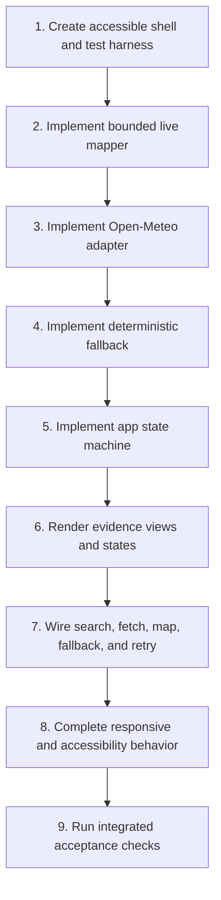

# Weather Evidence Workshop Proof of Concept Implementation Plan

> **For agentic workers:** REQUIRED SUB-SKILL: Use superpowers:subagent-driven-development (recommended) or superpowers:executing-plans to implement this plan task-by-task. Steps use checkbox (`- [ ]`) syntax for tracking.

**Goal:** Build a disposable browser weather app that searches public locations, fetches one Open-Meteo current/hourly/daily payload, maps it into a bounded `WeatherSignal`, and displays readable, raw, and mapped evidence with explicit fallback and failure states.

**Architecture:** Plain browser ES modules separate provider access, contract mapping, deterministic fallback, state transitions, rendering, and orchestration. UI renderers consume `WeatherSignal`; only the API adapter, mapper, fixtures, and raw viewer know Open-Meteo response fields. Forecast or mapping failure automatically activates a clearly labeled fictional fallback while preserving Retry.

**Tech Stack:** HTML5, CSS, browser JavaScript ES modules, Fetch API, AbortController, Node.js built-in `node:test`, no runtime or test dependencies.

## Global Constraints

- Use plain HTML, CSS, and JavaScript only.
- Use no framework, backend, database, authentication, analytics, deployment integration, or CDN library.
- Use Open-Meteo geocoding and forecast APIs as the only public data sources.
- Fetch current conditions, hourly forecast, and daily forecast in one forecast request after location selection.
- Treat the scenario as page context only; it must not change API parameters, mapping, or weather interpretation.
- Support responsive layouts from 320 px upward without horizontal scrolling.
- Give every form control an accessible name, make keyboard focus visible, and announce changing status through an ARIA live region.
- Keep fallback data fictional, deterministic, clearly labeled, and distinguishable from a successful live response.
- Keep the artifact disposable and workshop-only.
- Region 3 is a labeled inert placeholder; only Regions 1 and 2 are implemented.

---

## Source Documents

- Product requirements: `plans/spec_v1.md`
- Proposed architecture decision: `plans/adr_v1.md`

## File Structure

| Path | Responsibility |
|---|---|
| `package.json` | Declare ES-module mode and dependency-free test command. |
| `index.html` | Accessible three-region shell, controls, evidence containers, templates, and live region. |
| `styles.css` | Responsive layout, visible focus, state/provenance styling, tables, and raw/mapped viewers. |
| `js/api.js` | Open-Meteo geocoding and single forecast-request construction/execution. |
| `js/mapper.js` | Validate and map Open-Meteo forecast payloads into live `WeatherSignal`. |
| `js/fallback.js` | Produce deterministic fictional fallback `WeatherSignal`. |
| `js/state.js` | Define valid app state and pure state transitions. |
| `js/ui.js` | Render location results, state messages, readable evidence, raw JSON, and mapped JSON. |
| `js/app.js` | Wire controls, debounce search, cancel stale requests, orchestrate fetch/map/fallback/retry. |
| `tests/fixtures/open-meteo.js` | Deterministic geocoding and valid/malformed forecast fixtures. |
| `tests/shell.test.js` | Verify required landmarks, accessible labels, evidence views, and placeholder exist. |
| `tests/api.test.js` | Verify URL parameters, one forecast call, and HTTP failure behavior. |
| `tests/mapper.test.js` | Verify exact field mapping, units, null behavior, and 24/7 bounds. |
| `tests/fallback.test.js` | Verify deterministic fallback shape and provenance. |
| `tests/state.test.js` | Verify allowed empty/loading/success/fallback/error transitions. |
| `tests/ui.test.js` | Verify pure formatting/view-model helpers used by rendering. |

## Public Interfaces

```js
// js/api.js
export function buildGeocodingUrl(query);
export function buildForecastUrl(location);
export async function searchLocations(query, { signal, fetchImpl = fetch } = {});
export async function fetchForecast(location, { signal, fetchImpl = fetch } = {});

// js/mapper.js
export const WEATHER_SIGNAL_UNITS;
export function mapForecastToWeatherSignal(payload, location, fetchedAt);

// js/fallback.js
export function createFallbackWeatherSignal(location, fetchedAt);

// js/state.js
export function createInitialState();
export function transition(state, event);

// js/ui.js
export function createUi(documentRef = document);
export function formatWeatherCode(code);
export function formatValue(value, unit);
```

`js/app.js` is the composition root and exports no domain API. Scenario remains app state and never becomes an argument to the mapper or fallback factory.

## Implementation Flow



### Task 1: Accessible Shell and Dependency-Free Test Harness

**Files:**
- Create: `package.json`
- Create: `index.html`
- Create: `styles.css`
- Create: `tests/shell.test.js`

**Interfaces:**
- Produces stable element IDs consumed by `createUi()`: `location-search`, `location-results`, `scenario`, `fetch-weather`, `status`, `current-view`, `hourly-view`, `daily-view`, `raw-view`, and `mapped-view`.
- Produces page regions identified by `region-context`, `region-evidence`, and `region-placeholder`.

- [ ] **Step 1: Create the test command and ES-module mode**

```json
{
  "name": "weather-evidence-workshop-poc",
  "private": true,
  "type": "module",
  "scripts": {
    "test": "node --test"
  }
}
```

- [ ] **Step 2: Write the failing shell test**

```js
// tests/shell.test.js
import assert from "node:assert/strict";
import { readFile } from "node:fs/promises";
import test from "node:test";

const html = await readFile(new URL("../index.html", import.meta.url), "utf8");

test("shell exposes three labeled regions", () => {
  for (const id of ["region-context", "region-evidence", "region-placeholder"]) {
    assert.match(html, new RegExp(`id=["']${id}["']`));
  }
});

test("controls and changing status have accessible hooks", () => {
  assert.match(html, /<label[^>]*for=["']location-search["']/);
  assert.match(html, /<label[^>]*for=["']scenario["']/);
  assert.match(html, /id=["']status["'][^>]*aria-live=["']polite["']/);
  assert.match(html, /id=["']fetch-weather["'][^>]*disabled/);
});

test("evidence provides readable, raw, and mapped containers", () => {
  for (const id of ["current-view", "hourly-view", "daily-view", "raw-view", "mapped-view"]) {
    assert.match(html, new RegExp(`id=["']${id}["']`));
  }
  assert.match(html, /<details[^>]*>[\s\S]*Raw Open-Meteo response/);
  assert.match(html, /<details[^>]*>[\s\S]*Mapped WeatherSignal/);
});
```

- [ ] **Step 3: Run the shell test and verify it fails**

Run: `npm test -- tests/shell.test.js`  
Expected: FAIL because `index.html` does not exist.

- [ ] **Step 4: Create the semantic page shell**

Create `index.html` with:

- `<!doctype html>`, viewport metadata, `styles.css`, and `<script type="module" src="./js/app.js">`.
- A visible workshop-only notice: `Disposable workshop proof of concept. Not approved architecture or an operational decision tool.`
- `<main>` containing three labeled `<section>` elements with the IDs above.
- Region 1 containing the labeled search input (`type="search"`, `autocomplete="off"`, `aria-controls="location-results"`, `aria-expanded="false"`), a result listbox, a required scenario `<select>` with an empty option plus `warehouse-planning` and `delivery-planning`, selected-location text, and a disabled `Fetch weather` button.
- A `<p id="status" aria-live="polite" aria-atomic="true">` after the controls.
- Region 2 containing a provenance banner, current/hourly/daily containers, and two separate `<details>` elements. Put `<pre id="raw-view">` in the raw details and `<pre id="mapped-view">` in the mapped details.
- Region 3 containing only its heading and `Reserved for a future workshop phase; no behavior is implemented.`

- [ ] **Step 5: Add baseline CSS without final visual tuning**

In `styles.css`, set `box-sizing: border-box`, prevent media and preformatted content from exceeding container width, use `overflow-wrap: anywhere` for JSON, provide a two-column layout above 760 px and one column below it, and add a `:focus-visible` outline at least 3 px wide. Do not hide focus or use fixed content widths.

- [ ] **Step 6: Run the shell test and verify it passes**

Run: `npm test -- tests/shell.test.js`  
Expected: 3 tests pass.

- [ ] **Step 7: Commit the shell**

```bash
git add package.json index.html styles.css tests/shell.test.js
git commit -m "feat: add accessible weather workshop shell"
```

### Task 2: Bounded Live WeatherSignal Mapper

**Files:**
- Create: `tests/fixtures/open-meteo.js`
- Create: `tests/mapper.test.js`
- Create: `js/mapper.js`

**Interfaces:**
- Consumes: an Open-Meteo forecast payload, selected location, and ISO fetched-at instant.
- Produces: `mapForecastToWeatherSignal(payload, location, fetchedAt)` returning the exact live contract in `plans/spec_v1.md` or throwing `WeatherSignalMappingError`.

- [ ] **Step 1: Create deterministic source fixtures**

In `tests/fixtures/open-meteo.js`, export:

```js
export const selectedLocation = Object.freeze({
  name: "Berlin",
  countryCode: "DE",
  latitude: 52.52,
  longitude: 13.41,
  timezone: "Europe/Berlin"
});

const hourlyTimes = Array.from({ length: 48 }, (_, index) =>
  new Date(Date.UTC(2026, 6, 21, index)).toISOString().slice(0, 16)
);
const dailyDates = Array.from({ length: 7 }, (_, index) =>
  new Date(Date.UTC(2026, 6, 21 + index)).toISOString().slice(0, 10)
);

export const validForecast = {
  timezone: "Europe/Berlin",
  current: {
    time: "2026-07-21T10:00",
    temperature_2m: 21.5,
    apparent_temperature: 20.8,
    relative_humidity_2m: 61,
    precipitation: 0,
    weather_code: 2,
    wind_speed_10m: 14.2,
    wind_direction_10m: 245,
    wind_gusts_10m: 24.5,
    cloud_cover: 44,
    surface_pressure: 1009.3,
    is_day: 1
  },
  hourly: {
    time: hourlyTimes,
    temperature_2m: hourlyTimes.map((_, index) => 18 + index / 10),
    precipitation_probability: hourlyTimes.map((_, index) => index % 4 * 10),
    precipitation: hourlyTimes.map(() => 0),
    weather_code: hourlyTimes.map(() => 2),
    wind_speed_10m: hourlyTimes.map((_, index) => 10 + index / 10)
  },
  daily: {
    time: dailyDates,
    temperature_2m_max: dailyDates.map((_, index) => 24 + index),
    temperature_2m_min: dailyDates.map((_, index) => 14 + index),
    precipitation_sum: dailyDates.map(() => 0),
    precipitation_probability_max: dailyDates.map((_, index) => index * 5),
    weather_code: dailyDates.map(() => 2),
    wind_speed_10m_max: dailyDates.map((_, index) => 20 + index),
    sunrise: dailyDates.map(date => `${date}T05:02`),
    sunset: dailyDates.map(date => `${date}T21:14`)
  }
};

export const malformedForecast = {
  ...validForecast,
  hourly: { ...validForecast.hourly, wind_speed_10m: [10] }
};
```

- [ ] **Step 2: Write failing contract tests**

Test that the mapper:

- emits `source: "open-meteo"`, live provenance, selected location, and the supplied `fetchedAt`;
- maps every current field and converts `is_day` values `1`/`0` to `true`/`false`;
- returns exactly 24 hourly and 7 daily entries;
- declares the exact section units from the spec;
- preserves a source `null` as `null`;
- throws `WeatherSignalMappingError` for missing sections, fewer than 24 source hours, fewer than 7 source days, or misaligned arrays.

Use this boundary assertion in `tests/mapper.test.js`:

```js
const signal = mapForecastToWeatherSignal(
  validForecast,
  selectedLocation,
  "2026-07-21T08:00:00.000Z"
);
assert.equal(signal.source, "open-meteo");
assert.equal(signal.provenance.mode, "live");
assert.equal(signal.current.values.isDay, true);
assert.equal(signal.hourly.values.length, 24);
assert.equal(signal.daily.values.length, 7);
assert.equal(signal.current.units.pressure, "hPa");
assert.equal(signal.hourly.units.precipitationProbability, "%");
assert.equal(signal.daily.units.sunrise, "ISO 8601 local time");
```

- [ ] **Step 3: Run mapper tests and verify they fail**

Run: `npm test -- tests/mapper.test.js`  
Expected: FAIL with `ERR_MODULE_NOT_FOUND` for `js/mapper.js`.

- [ ] **Step 4: Implement validation and mapping**

In `js/mapper.js`:

- Export frozen `WEATHER_SIGNAL_UNITS` with separate `current`, `hourly`, and `daily` objects matching the spec.
- Export `WeatherSignalMappingError extends Error` with `name = "WeatherSignalMappingError"`.
- Use a `requireObject(value, name)` guard.
- Use a `requireAlignedArrays(section, fields, minimumLength)` guard that requires `time` and every named field to be arrays of equal length and at least the required size.
- Map source values with `value ?? null`; do not use `value || 0`.
- Slice hourly arrays to indexes `0..23` and daily arrays to indexes `0..6`.
- Return new objects and arrays; do not mutate the source payload.
- Set timezone from `payload.timezone || location.timezone`; throw if neither is a non-empty string.

The current mapping table is:

| Contract field | Open-Meteo field |
|---|---|
| `temperature` | `temperature_2m` |
| `apparentTemperature` | `apparent_temperature` |
| `humidity` | `relative_humidity_2m` |
| `precipitation` | `precipitation` |
| `weatherCode` | `weather_code` |
| `windSpeed` | `wind_speed_10m` |
| `windDirection` | `wind_direction_10m` |
| `windGusts` | `wind_gusts_10m` |
| `cloudCover` | `cloud_cover` |
| `pressure` | `surface_pressure` |
| `isDay` | `is_day === 1`, `is_day === 0`, otherwise `null` |

Use the exact hourly and daily field names from `validForecast` and exact contract property names from `plans/spec_v1.md`.

- [ ] **Step 5: Run mapper tests and verify they pass**

Run: `npm test -- tests/mapper.test.js`  
Expected: all mapper tests pass.

- [ ] **Step 6: Commit the mapping boundary**

```bash
git add js/mapper.js tests/mapper.test.js tests/fixtures/open-meteo.js
git commit -m "feat: map Open-Meteo into bounded weather signal"
```

### Task 3: Open-Meteo API Adapter

**Files:**
- Create: `tests/api.test.js`
- Create: `js/api.js`

**Interfaces:**
- Consumes: search text or `{ latitude, longitude }`, optional `AbortSignal`, and injectable `fetchImpl`.
- Produces: reduced public location candidates or an unmodified forecast JSON object.
- Throws: `OpenMeteoRequestError` with `kind` equal to `network`, `http`, or `payload`.

- [ ] **Step 1: Write failing URL and request tests**

Assert that `buildGeocodingUrl(" New York ")` uses:

```text
https://geocoding-api.open-meteo.com/v1/search?name=New+York&count=10&language=en&format=json
```

Assert that `buildForecastUrl(selectedLocation)` targets `https://api.open-meteo.com/v1/forecast` and contains:

```text
latitude=52.52
longitude=13.41
timezone=auto
forecast_days=7
current=temperature_2m,apparent_temperature,relative_humidity_2m,precipitation,weather_code,wind_speed_10m,wind_direction_10m,wind_gusts_10m,cloud_cover,surface_pressure,is_day
hourly=temperature_2m,precipitation_probability,precipitation,weather_code,wind_speed_10m
daily=temperature_2m_max,temperature_2m_min,precipitation_sum,precipitation_probability_max,weather_code,wind_speed_10m_max,sunrise,sunset
```

Inject a fetch spy and assert `fetchForecast` calls it exactly once. Also assert non-2xx responses throw `OpenMeteoRequestError` rather than attempting to map an error payload.

- [ ] **Step 2: Run API tests and verify they fail**

Run: `npm test -- tests/api.test.js`  
Expected: FAIL with `ERR_MODULE_NOT_FOUND` for `js/api.js`.

- [ ] **Step 3: Implement the adapter**

Use `URL` and `URLSearchParams`, not string concatenation. Trim geocoding input and throw `TypeError` when it has fewer than two characters. Reduce geocoding results to:

```js
{
  id: result.id,
  name: result.name,
  admin1: result.admin1 ?? null,
  country: result.country ?? null,
  countryCode: result.country_code ?? null,
  latitude: result.latitude,
  longitude: result.longitude,
  timezone: result.timezone ?? "auto"
}
```

Return `[]` when the geocoding payload has no `results` array. Keep forecast JSON unmodified so the raw viewer and mapper receive the same object. Pass `{ signal }` to every fetch call.

- [ ] **Step 4: Run API tests and verify they pass**

Run: `npm test -- tests/api.test.js`  
Expected: all API tests pass and the forecast spy records one call.

- [ ] **Step 5: Commit the provider adapter**

```bash
git add js/api.js tests/api.test.js
git commit -m "feat: add Open-Meteo browser adapter"
```

### Task 4: Deterministic Fictional Fallback

**Files:**
- Create: `tests/fallback.test.js`
- Create: `js/fallback.js`

**Interfaces:**
- Consumes: selected location and supplied fetched-at instant.
- Produces: a deterministic `WeatherSignal` with `source: "fictional-fallback"`, fallback provenance, 24 hourly values, and 7 daily values.

- [ ] **Step 1: Write failing fallback tests**

```js
const first = createFallbackWeatherSignal(selectedLocation, "2026-07-21T08:00:00.000Z");
const second = createFallbackWeatherSignal(selectedLocation, "2026-07-21T08:00:00.000Z");
assert.deepEqual(first, second);
assert.equal(first.source, "fictional-fallback");
assert.equal(first.provenance.mode, "fallback");
assert.equal(first.provenance.label, "Fictional deterministic fallback");
assert.equal(first.hourly.values.length, 24);
assert.equal(first.daily.values.length, 7);
assert.deepEqual(first.current.units, WEATHER_SIGNAL_UNITS.current);
```

Also assert the input location object is unchanged and the output contains no `scenario` property.

- [ ] **Step 2: Run fallback tests and verify they fail**

Run: `npm test -- tests/fallback.test.js`  
Expected: FAIL with `ERR_MODULE_NOT_FOUND` for `js/fallback.js`.

- [ ] **Step 3: Implement a fixed fictional weather pattern**

In `js/fallback.js`, import `WEATHER_SIGNAL_UNITS`, derive local dates from a fixed base of `2026-01-15T09:00`, and use fixed values rather than randomness or the current clock. Use the selected location only for location metadata. Use these recognizable fictional values:

- Current: 18 °C, apparent 17 °C, humidity 55%, precipitation 0 mm, WMO code 1, wind 12 km/h from 220°, gusts 20 km/h, cloud cover 30%, pressure 1013 hPa, daytime true.
- Hourly: temperature `18 + Math.sin(index / 4) * 2`, probability `(index % 6) * 10`, precipitation `index % 6 === 5 ? 0.2 : 0`, code `index % 6 === 5 ? 61 : 1`, wind `12 + index % 5`.
- Daily: max `20 + index`, min `10 + index`, precipitation sum `index % 3 === 2 ? 1.5 : 0`, probability `index % 3 === 2 ? 40 : 10`, code `index % 3 === 2 ? 61 : 1`, max wind `20 + index`, sunrise `07:30`, sunset `17:15`.

Use the supplied `fetchedAt` only for provenance. This makes repeated tests and demonstrations stable.

- [ ] **Step 4: Run fallback tests and verify they pass**

Run: `npm test -- tests/fallback.test.js`  
Expected: all fallback tests pass.

- [ ] **Step 5: Commit fallback data**

```bash
git add js/fallback.js tests/fallback.test.js
git commit -m "feat: add labeled deterministic weather fallback"
```

### Task 5: Explicit Application State Machine

**Files:**
- Create: `tests/state.test.js`
- Create: `js/state.js`

**Interfaces:**
- Consumes: current immutable state and named event.
- Produces: a new state with `phase` equal to `empty`, `searching`, `ready`, `loading`, `success`, `fallback`, or `error`.

- [ ] **Step 1: Write failing transition tests**

Cover this event table:

| Event | Result |
|---|---|
| `SEARCH_STARTED` | `searching`, latest query retained, old search error cleared |
| `SEARCH_SUCCEEDED` | `ready` if results exist; `empty` with no-results message otherwise |
| `SEARCH_FAILED` | `error`, geocoding retry descriptor retained, no fallback generated |
| `LOCATION_SELECTED` | selected location set, results closed |
| `SCENARIO_SELECTED` | scenario set without changing weather evidence |
| `FORECAST_STARTED` | `loading`, fetch disabled, prior provenance not announced as new |
| `FORECAST_SUCCEEDED` | `success`, raw response and live signal stored |
| `FORECAST_FAILED_WITH_FALLBACK` | `fallback`, failure message and fallback signal stored, raw response set to `null` |
| `RETRY_FORECAST` | `loading`, same selected location and scenario retained |

Assert `canFetch` is true only when location and scenario exist and phase is not `loading`.

- [ ] **Step 2: Run state tests and verify they fail**

Run: `npm test -- tests/state.test.js`  
Expected: FAIL with `ERR_MODULE_NOT_FOUND` for `js/state.js`.

- [ ] **Step 3: Implement pure transitions**

`createInitialState()` must return:

```js
{
  phase: "empty",
  query: "",
  locations: [],
  selectedLocation: null,
  scenario: "",
  signal: null,
  rawResponse: null,
  message: "Search for a public location to begin.",
  retry: null,
  canFetch: false
}
```

Implement `transition` as a `switch (event.type)` that returns a new object and calls an internal `deriveCanFetch(state)` before returning. Throw `TypeError` for an unknown event so orchestration mistakes fail during development rather than silently corrupting state.

- [ ] **Step 4: Run state tests and verify they pass**

Run: `npm test -- tests/state.test.js`  
Expected: all state tests pass.

- [ ] **Step 5: Commit the state model**

```bash
git add js/state.js tests/state.test.js
git commit -m "feat: model weather workflow states"
```

### Task 6: Evidence Views and State Rendering

**Files:**
- Create: `tests/ui.test.js`
- Create: `js/ui.js`
- Modify: `index.html`
- Modify: `styles.css`

**Interfaces:**
- Consumes: complete app state from `js/state.js`.
- Produces: DOM updates only; returns action hooks `onLocationSelected`, `onFetch`, `onRetry`, `onQueryChanged`, and `onScenarioChanged` from `createUi()`.

- [ ] **Step 1: Write failing formatter tests**

```js
assert.equal(formatValue(null, "°C"), "Not available");
assert.equal(formatValue(21.5, "°C"), "21.5 °C");
assert.equal(formatValue(false, "boolean"), "No");
assert.equal(formatWeatherCode(0), "Clear sky (WMO 0)");
assert.equal(formatWeatherCode(999), "WMO code 999");
```

Cover WMO codes used by the fixture and fallback without converting them into operational advice.

- [ ] **Step 2: Run UI tests and verify they fail**

Run: `npm test -- tests/ui.test.js`  
Expected: FAIL with `ERR_MODULE_NOT_FOUND` for `js/ui.js`.

- [ ] **Step 3: Implement pure formatters and safe DOM rendering**

In `js/ui.js`:

- Build DOM with `createElement` and assign external text with `textContent`; never interpolate API text into `innerHTML`.
- Render location results as listbox options with stable generated IDs, text containing name/admin/country, and coordinate detail.
- Render current values as a definition list.
- Render hourly and daily evidence as semantic tables with captions and horizontally contained wrappers; table overflow must stay inside Region 2, not the page.
- Render JSON with `JSON.stringify(value, null, 2)` into `<pre>` text content.
- Render live provenance with `data-provenance="live"` and fallback provenance with `data-provenance="fallback"`.
- For fallback, put `No successful live Open-Meteo response is available.` in the raw viewer.
- For empty/loading/error states, clear stale evidence unless state explicitly carries retained evidence.
- Set Retry visibility from `state.retry` and fetch disabled state from `!state.canFetch`.
- Update the polite status element for normal transitions; render a separate `role="alert"` node for request failure text.

- [ ] **Step 4: Run UI tests and verify they pass**

Run: `npm test -- tests/ui.test.js`  
Expected: all formatter tests pass.

- [ ] **Step 5: Perform the first browser rendering check**

Open `index.html` through a local static server and verify:

- Region 1 appears before Region 2 in reading order.
- Region 3 is labeled and contains no interactive element.
- Empty evidence text is visible before any request.
- Raw and mapped details are distinct and collapsed initially.

- [ ] **Step 6: Commit evidence rendering**

```bash
git add js/ui.js tests/ui.test.js index.html styles.css
git commit -m "feat: render weather evidence and provenance states"
```

### Task 7: Search, Fetch, Map, Automatic Fallback, and Retry Orchestration

**Files:**
- Create: `js/app.js`
- Modify: `tests/api.test.js`
- Modify: `tests/state.test.js`

**Interfaces:**
- Consumes all public interfaces defined above and DOM actions from `createUi()`.
- Produces the complete browser workflow; no new domain interface.

- [ ] **Step 1: Add stale-search and single-fetch tests**

Add an API-level abort test that passes an `AbortController.signal` and verifies it reaches `fetchImpl`. Add a state test proving an older search result cannot replace the latest query's result when orchestration omits its stale request ID. Define request IDs as monotonically increasing integers in `app.js`, and dispatch search success only when the completed ID equals the active ID.

- [ ] **Step 2: Run focused tests before orchestration**

Run: `npm test -- tests/api.test.js tests/state.test.js`  
Expected: new tests fail until abort forwarding and request identity handling are complete.

- [ ] **Step 3: Wire debounced geocoding**

In `js/app.js`:

- Keep `let state = createInitialState()`, `let searchTimer`, `let searchController`, and `let activeSearchId = 0`.
- On every query change, clear the prior 300 ms timer and abort the prior controller.
- For fewer than two trimmed characters, clear results and announce the minimum without calling the API.
- After 300 ms, increment `activeSearchId`, dispatch `SEARCH_STARTED`, call `searchLocations`, and apply results only if the local request ID still equals `activeSearchId`.
- Ignore `AbortError`; convert other failures into `SEARCH_FAILED` with a retry descriptor that repeats the same query.

- [ ] **Step 4: Wire selection and scenario without contract leakage**

Dispatch `LOCATION_SELECTED` with the reduced location object and `SCENARIO_SELECTED` with one of the two allowed strings. Do not pass scenario to `buildForecastUrl`, `fetchForecast`, `mapForecastToWeatherSignal`, or `createFallbackWeatherSignal`.

- [ ] **Step 5: Wire the one forecast action**

On Fetch:

```js
state = transition(state, { type: "FORECAST_STARTED" });
render();
try {
  const rawResponse = await fetchForecast(state.selectedLocation);
  const signal = mapForecastToWeatherSignal(
    rawResponse,
    state.selectedLocation,
    new Date().toISOString()
  );
  state = transition(state, { type: "FORECAST_SUCCEEDED", rawResponse, signal });
} catch (error) {
  const signal = createFallbackWeatherSignal(
    state.selectedLocation,
    new Date().toISOString()
  );
  state = transition(state, {
    type: "FORECAST_FAILED_WITH_FALLBACK",
    signal,
    message: "Live weather could not be loaded. Fictional deterministic fallback is shown.",
    retry: { kind: "forecast" }
  });
}
render();
```

This catch covers network, HTTP, JSON, and mapping failures. It must not dispatch `FORECAST_SUCCEEDED` for fallback.

- [ ] **Step 6: Wire Retry**

For `retry.kind === "forecast"`, rerun the same forecast action with the retained selected location and scenario. For `retry.kind === "search"`, rerun the retained query. Disable duplicate forecast actions while `phase === "loading"`.

- [ ] **Step 7: Run all automated tests**

Run: `npm test`  
Expected: all shell, API, mapper, fallback, state, and UI tests pass with zero failures.

- [ ] **Step 8: Exercise live and fallback paths manually**

1. Search `Berlin`, select a result, select each scenario in turn, and verify scenario does not change the forecast URL or mapped contract.
2. Fetch live weather and verify current, 24 hourly, and 7 daily records appear.
3. In browser developer tools, block `api.open-meteo.com`, fetch again, and verify automatic fallback appears with Retry.
4. Verify the fallback raw view says no live response is available and the mapped view says `fictional-fallback`.
5. Unblock the API, choose Retry, and verify the state returns to labeled live evidence.

- [ ] **Step 9: Commit orchestration**

```bash
git add js/app.js tests/api.test.js tests/state.test.js
git commit -m "feat: orchestrate weather evidence workflow"
```

### Task 8: Responsive and Accessibility Completion

**Files:**
- Modify: `styles.css`
- Modify: `index.html`
- Modify: `js/ui.js`
- Modify: `tests/shell.test.js`

**Interfaces:**
- Preserves all IDs and module contracts from prior tasks.
- Completes keyboard, announcement, focus, and 320 px requirements.

- [ ] **Step 1: Extend static accessibility tests**

Assert the HTML contains one `<main>`, headings for all three regions, the scenario's empty required option, a listbox relationship for search, and no positive `tabindex`. Assert the workshop-only safety notice includes both `proof of concept` and `not approved`.

- [ ] **Step 2: Run the shell tests and verify the new assertions fail where markup is incomplete**

Run: `npm test -- tests/shell.test.js`  
Expected: any missing semantic or safety marker fails with the specific assertion.

- [ ] **Step 3: Complete keyboard behavior**

Implement combobox/listbox behavior in `ui.js`:

- `ArrowDown` and `ArrowUp` move the active result without moving focus out of the search input.
- `Enter` selects the active result.
- `Escape` closes results and sets `aria-expanded="false"`.
- `aria-activedescendant` references only an existing visible option.
- Pointer selection and keyboard selection call the same `onLocationSelected` hook.

- [ ] **Step 4: Complete responsive CSS**

At 320 px:

- Set page padding no greater than 12 px.
- Use `minmax(0, 1fr)` for every grid track.
- Give inputs, selects, and command buttons at least 44 px block size.
- Keep preformatted JSON and table wrappers at `max-width: 100%; overflow: auto`.
- Never assign a child a fixed width wider than its containing block.

Above 760 px, allow Region 1 controls and Region 2 summaries to use multiple columns while keeping document order unchanged.

- [ ] **Step 5: Verify announcements and focus**

Using keyboard only, confirm search start/completion, no results, forecast loading, live success, fallback activation, and retry completion are announced once. Confirm every interactive element has a visible `:focus-visible` indicator and the collapsed raw/mapped summaries are keyboard operable.

- [ ] **Step 6: Verify viewport boundaries**

At widths 320, 375, 768, and 1280 px, run in the browser console:

```js
document.documentElement.scrollWidth <= document.documentElement.clientWidth
```

Expected: `true` at every width. Internal raw/table wrappers may scroll without increasing document width.

- [ ] **Step 7: Run all tests and commit accessibility/responsive work**

Run: `npm test`  
Expected: all tests pass.

```bash
git add index.html styles.css js/ui.js tests/shell.test.js
git commit -m "fix: complete accessible responsive weather UI"
```

### Task 9: Integrated Acceptance and Scope Review

**Files:**
- Modify only if a failing acceptance check exposes a defect in an existing file.

**Interfaces:**
- Verifies the complete app against `plans/spec_v1.md` and `plans/adr_v1.md`.

- [ ] **Step 1: Run the complete automated suite**

Run: `npm test`  
Expected: zero failed, skipped, or cancelled tests.

- [ ] **Step 2: Verify request boundaries in browser network tools**

- One completed geocoding request corresponds to the latest debounced query.
- One forecast request follows each Fetch or Retry action.
- The forecast request contains current, hourly, and daily variables together.
- No request is made to a host other than the two Open-Meteo API hosts.

- [ ] **Step 3: Verify contract boundaries**

- Readable current/hourly/daily components receive `WeatherSignal`, not raw Open-Meteo field names.
- The live mapped object has 24 hourly and 7 daily values with section-specific units.
- `null` renders as `Not available`, not zero.
- Scenario is absent from `WeatherSignal` and forecast parameters.
- Raw response is unchanged live JSON and is unavailable during fallback.

- [ ] **Step 4: Verify all visible states**

Exercise and record pass/fail for empty, search loading, no results, geocoding error with retry, forecast loading, live success, automatic fallback with retry, and successful live retry. Confirm fallback never uses live-success copy, color treatment, provenance, or announcement.

- [ ] **Step 5: Verify safety boundaries**

Confirm the page contains no persistence, authentication, analytics, internal-system fields, customer/supplier fields, recommendations, approvals, or autonomous actions. Confirm Region 3 has no behavior and the workshop/non-approved notice remains visible.

- [ ] **Step 6: Verify accessibility and responsiveness**

Repeat keyboard-only operation and the 320/375/768/1280 px overflow checks from Task 8. Check labels and state announcements with browser accessibility tooling.

- [ ] **Step 7: Review implementation against the ADR**

Confirm provider coupling exists only in `js/api.js`, `js/mapper.js`, fixtures, and the raw viewer; the mapper is pure; no backend exists; and all ADR revisit triggers remain absent.

- [ ] **Step 8: Commit only acceptance-driven fixes**

```bash
git add index.html styles.css js/api.js js/mapper.js js/fallback.js js/state.js js/ui.js js/app.js tests/shell.test.js tests/api.test.js tests/mapper.test.js tests/fallback.test.js tests/state.test.js tests/ui.test.js
git commit -m "fix: satisfy weather workshop acceptance checks"
```

Skip this commit when no files changed.

## Plan Self-Review

- **Spec coverage:** Tasks cover location search, scenario context, one current/hourly/daily fetch, bounded mapping, readable/raw/mapped views, automatic fallback, Retry, all visible states, Region 3 placeholder, accessibility, responsiveness, safety, and tests.
- **Scope control:** No backend, persistence, authentication, analytics, deployment, internal integration, operational recommendation, or Region 3 behavior is introduced.
- **Type consistency:** `WeatherSignal`, location, units, event names, and module signatures match the source spec and are stable across tasks.
- **Fallback consistency:** Forecast and mapping failures activate a deterministic fallback; geocoding failures remain error-with-retry; fallback never has a raw Open-Meteo payload or live-success state.
- **Test strategy:** Pure provider, mapper, fallback, state, and formatting logic is automated with `node:test`; browser-only DOM, network, keyboard, live-region, and responsive behavior has explicit manual acceptance steps.