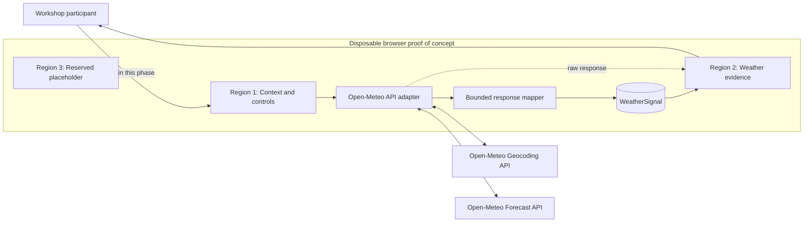
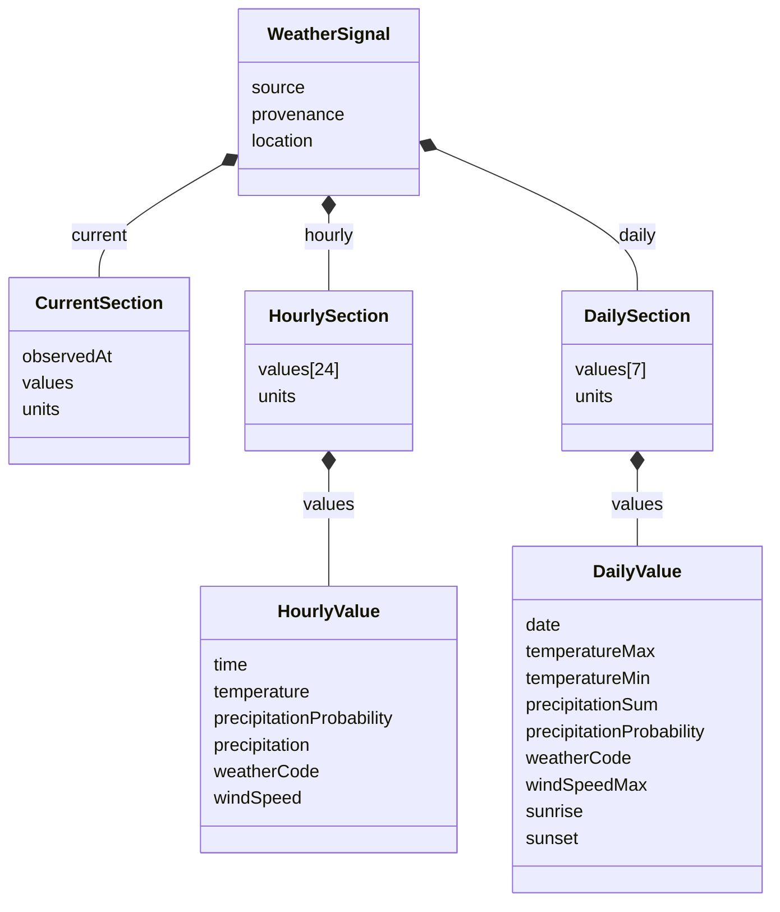
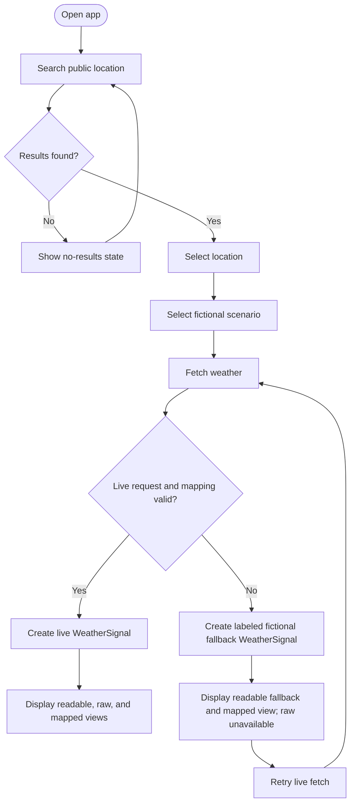

# Weather Evidence Workshop Proof of Concept - Feature Spec v1

**Document type:** Feature specification / PRD  
**Status:** Draft for workshop use  
**Date:** 2026-07-21  
**Scope:** Weather app only; Regions 1 and 2 implemented, Region 3 placeholder only

## Problem Statement

Workshop participants need a small, inspectable example of an agent-assisted architecture workflow that turns a public API response into a stable application-owned contract. Directly coupling a page to Open-Meteo's response shape would obscure the boundary being taught and make it harder to compare source evidence with mapped evidence.

This disposable proof of concept lets a participant search for a public location, fetch public weather data, and inspect both the raw response and a bounded `WeatherSignal`. It is an educational artifact, not approved architecture, production software, or an operational decision system.

## Goal

Demonstrate, in a dependency-free browser application, how public Open-Meteo current, hourly, and daily data can be fetched once, mapped into a bounded `WeatherSignal` contract, and presented as readable, raw, and mapped evidence without implying production readiness or operational approval.

## Target Users

- **Primary:** Workshop participants practicing agent-assisted product, architecture, and implementation planning.
- **Secondary:** Workshop facilitators reviewing whether the participant can define system boundaries, visible failure states, and testable contracts.
- **Not a target user:** Production planners, approvers, customers, suppliers, or operators making real warehouse or delivery decisions.

## Goals and Success Metrics

Because analytics and persistence are out of scope, success is measured through workshop acceptance checks rather than behavioral telemetry.

| Goal | Verifiable success threshold |
|---|---|
| Complete the core evidence flow | A participant can search, select, fetch, map, and inspect all three evidence views in one browser session. |
| Preserve a bounded mapping boundary | A valid live response maps to one current record, exactly the next 24 local hourly records, and the next 7 local daily records when Open-Meteo supplies those ranges. |
| Make provenance unambiguous | Every live result is labeled live; every fallback result is persistently labeled fictional fallback and is never announced or styled as live success. |
| Expose all required states | Empty, loading, live success, fallback, error-with-retry, and location no-results states can each be exercised and observed. |
| Meet baseline accessibility | Every form control has an accessible name, all actions are keyboard operable, focus is visible, and status changes are announced through a live region. |
| Meet responsive boundary | No horizontal page scrolling occurs at viewport widths from 320 px upward. |

No usage, adoption, retention, or business-impact metrics are collected.

## User Stories

- As a workshop participant, I want to search public locations so that I can choose the coordinates used for weather evidence.
- As a workshop participant, I want to select a fictional planning scenario so that the page has operational context without connecting to a real operational system.
- As a workshop participant, I want one action to fetch current, hourly, and daily weather so that I can observe a single-source request boundary.
- As a workshop participant, I want readable, raw, and mapped views so that I can compare source evidence with the application-owned contract.
- As a workshop participant, I want visible loading, empty, success, fallback, and retry states so that failure behavior is part of the architecture exercise.
- As a keyboard or assistive-technology user, I want named controls, visible focus, and announced status changes so that I can complete the workflow without relying on pointer use or visual status alone.

## Constraints

- Use plain HTML, CSS, and JavaScript only.
- Use no framework, backend, database, authentication, analytics, deployment integration, or CDN library.
- Use Open-Meteo geocoding and forecast APIs as the only public data sources.
- Fetch current conditions, hourly forecast, and daily forecast in one forecast request after location selection.
- Treat the scenario as page context only; it must not change API parameters, mapping, or weather interpretation.
- Support responsive layouts from 320 px upward without horizontal scrolling.
- Give every form control an accessible name, make keyboard focus visible, and announce changing status through an ARIA live region.
- Keep fallback data fictional, deterministic, clearly labeled, and distinguishable from a successful live response.
- Keep the artifact disposable and workshop-only.

## Functional Requirements

### P0 - Must Have

#### FR-1: Public location search

- Accept a trimmed query of at least two characters.
- Debounce search by 300 ms and cancel or ignore stale geocoding requests.
- Query only the Open-Meteo geocoding API.
- Present keyboard-operable results with location name, administrative area when available, country, and coordinates sufficient to distinguish duplicates.
- Show an explicit no-results state for a completed search with no matches.
- Do not enable weather fetch until a result is selected.

**Acceptance criteria**

- Given fewer than two trimmed characters, when the input changes, then no geocoding request is sent and the prompt remains visible.
- Given two or more trimmed characters, when results return out of order, then only results for the latest query are displayed.
- Given no matches, when the request completes, then a visible no-results message is announced.

#### FR-2: Fictional scenario selector

- Offer exactly `Warehouse planning` and `Delivery planning`.
- Require one scenario selection before weather fetch.
- Keep scenario state outside `WeatherSignal`.
- Do not derive recommendations, risk ratings, or approvals from the selection.

#### FR-3: Single weather fetch action

- Provide one primary action labeled `Fetch weather`.
- Send one Open-Meteo forecast request for the selected latitude and longitude with `timezone=auto`.
- Request these current variables: temperature, apparent temperature, relative humidity, precipitation, weather code, wind speed, wind direction, wind gusts, cloud cover, surface pressure, and is-day.
- Request these hourly variables: temperature, precipitation probability, precipitation, weather code, and wind speed.
- Request these daily variables: temperature maximum/minimum, precipitation sum, precipitation probability maximum, weather code, wind speed maximum, sunrise, and sunset.
- Bound mapped output to the next 24 local hourly entries and next 7 local daily entries.
- Disable duplicate fetches while a request is in progress.

#### FR-4: Map to `WeatherSignal`

- Validate required arrays and aligned indexes before mapping.
- Normalize values into the units declared by the contract.
- Preserve WMO weather codes without inventing operational meaning.
- Represent unavailable source values as `null`; do not silently substitute zero.
- Reject a live response that cannot produce the required bounded sections and enter the failure path.
- Produce deterministic fallback data through the same contract shape.

#### FR-5: Three distinct evidence views

- Provide a readable weather view for current, hourly, and daily evidence.
- Provide a collapsible raw-response view containing the unmodified successful Open-Meteo forecast payload.
- Provide a collapsible mapped-object view containing the resulting `WeatherSignal`.
- Keep the three views visually and semantically distinct.
- When fallback is active, the raw-response view must say that no successful live response is available; it must not fabricate an Open-Meteo payload.

#### FR-6: Visible application states

- Implement the state model in [Visible States](#visible-states).
- Announce state transitions with a polite live region, except urgent request failures may use an assertive alert.
- Keep Retry available in both error and fallback states.

#### FR-7: Interface regions

- Render the three page-shell regions described in [Interface Regions](#interface-regions).
- Implement behavior only in Regions 1 and 2.
- Render Region 3 as a reserved, labeled placeholder with no controls or implied future behavior.

### P1 - Nice to Have

- Preserve the selected location and scenario while retrying a failed weather request.
- Format timestamps using the selected location's Open-Meteo timezone while retaining ISO 8601 values in mapped and raw views.
- Provide accessible table captions or list headings for hourly and daily evidence.

### P2 - Future Considerations

- Additional public weather sources behind separate adapters.
- User-controlled units, provided mapping remains explicit and bounded.
- Operational interpretation in a separately approved product slice.

These are not implemented in this phase.

## WeatherSignal Contract

`WeatherSignal` is the application-owned boundary. Open-Meteo field names may appear in the raw view and adapter code but must not leak into UI components that consume this contract.

```ts
type WeatherSignal = {
  source: "open-meteo" | "fictional-fallback";
  provenance: {
    mode: "live" | "fallback";
    label: "Live public weather data" | "Fictional deterministic fallback";
    fetchedAt: string; // ISO 8601 instant
  };
  location: {
    name: string;
    countryCode: string | null;
    latitude: number;
    longitude: number;
    timezone: string;
  };
  current: {
    observedAt: string; // ISO 8601 local time from source
    values: {
      temperature: number | null;
      apparentTemperature: number | null;
      humidity: number | null;
      precipitation: number | null;
      weatherCode: number | null;
      windSpeed: number | null;
      windDirection: number | null;
      windGusts: number | null;
      cloudCover: number | null;
      pressure: number | null;
      isDay: boolean | null;
    };
    units: {
      temperature: "°C";
      apparentTemperature: "°C";
      humidity: "%";
      precipitation: "mm";
      weatherCode: "WMO code";
      windSpeed: "km/h";
      windDirection: "°";
      windGusts: "km/h";
      cloudCover: "%";
      pressure: "hPa";
      isDay: "boolean";
    };
  };
  hourly: {
    values: Array<{
      time: string;
      temperature: number | null;
      precipitationProbability: number | null;
      precipitation: number | null;
      weatherCode: number | null;
      windSpeed: number | null;
    }>; // exactly 24 entries
    units: {
      temperature: "°C";
      precipitationProbability: "%";
      precipitation: "mm";
      weatherCode: "WMO code";
      windSpeed: "km/h";
    };
  };
  daily: {
    values: Array<{
      date: string; // YYYY-MM-DD in location timezone
      temperatureMax: number | null;
      temperatureMin: number | null;
      precipitationSum: number | null;
      precipitationProbability: number | null;
      weatherCode: number | null;
      windSpeedMax: number | null;
      sunrise: string | null;
      sunset: string | null;
    }>; // exactly 7 entries
    units: {
      temperatureMax: "°C";
      temperatureMin: "°C";
      precipitationSum: "mm";
      precipitationProbability: "%";
      weatherCode: "WMO code";
      windSpeedMax: "km/h";
      sunrise: "ISO 8601 local time";
      sunset: "ISO 8601 local time";
    };
  };
};
```

Scenario is intentionally excluded because it is fictional UI context, not weather evidence. Unit labels live in each nested section so a consumer can render values without knowing Open-Meteo's unit keys.

## Interface Regions

### Region 1 - Context and Controls

- Accessible public location search and selectable geocoding results.
- Required fictional scenario selector: warehouse planning or delivery planning.
- Selected-location summary.
- One `Fetch weather` action.
- Status live region associated with the workflow.

### Region 2 - Weather Evidence

- Readable current-conditions summary.
- Next-24-hours forecast.
- Next-7-days forecast.
- Collapsible raw Open-Meteo response viewer.
- Collapsible mapped `WeatherSignal` viewer.
- Persistent provenance label and state-specific actions.

### Region 3 - Reserved Placeholder

- Visible label identifying the region as reserved and out of scope.
- No controls, data integration, recommendations, or implied production capability.

## Visible States

| State | Trigger | Required presentation | Available action |
|---|---|---|---|
| Empty | No location selected or no weather fetched | Prompt to search, select a location, choose a scenario, and fetch; evidence area contains no stale result | Search/select/configure |
| Loading | Geocoding or forecast request pending | Named progress message; fetch disabled during forecast request; prior evidence not represented as newly current | Wait; a new search may supersede stale geocoding |
| Live success | Valid Open-Meteo response mapped successfully | `Live public weather data` label, readable evidence, raw response, mapped object, success announcement | Fetch again |
| Error with retry | Geocoding request fails, or no valid fallback is available | Specific non-technical error, preserved valid inputs, visible Retry where applicable | Retry |
| Fallback | Forecast request or mapping fails | Automatically display deterministic fictional data with persistent `Fictional deterministic fallback` label; explain live failure; raw viewer states no live response | Retry live fetch |
| No results | Valid geocoding response has zero matches | Search-specific empty message, no weather-fetch enablement | Revise search |

Fallback is its own terminal display state, not a subtype of success. Activating it must never emit the live-success announcement, reuse the live-success provenance label, or present fabricated content in the raw Open-Meteo viewer.

## Component Diagram



## Request Sequence

```mermaid
sequenceDiagram
  actor User as Workshop participant
  participant Browser
  participant Geo as Open-Meteo Geocoding
  participant Forecast as Open-Meteo Forecast
  User->>Browser: Enter location query
  Browser->>Geo: GET search?name=query
  Geo-->>Browser: Public location candidates
  Browser-->>User: Display selectable results
  User->>Browser: Select location and scenario
  User->>Browser: Fetch weather
  Browser->>Forecast: GET forecast(latitude, longitude, current, hourly, daily, timezone=auto)
  alt Valid live response
    Forecast-->>Browser: Current + hourly + daily payload
    Browser->>Browser: Validate and map WeatherSignal
    Browser-->>User: Live readable, raw, and mapped views
  else Network, HTTP, parse, or mapping failure
    Forecast--xBrowser: Failure or unusable payload
    Browser->>Browser: Create deterministic fictional WeatherSignal
    Browser-->>User: Labeled fallback + Retry; no live-success state
  end
```

## Data Model Diagram



## User Flow



## Safety Boundaries

- The page must identify itself as a disposable workshop proof of concept.
- The page must not claim or imply approved architecture, production readiness, operational authority, or autonomous approval.
- Only public Open-Meteo data and fictional deterministic fallback data may be processed.
- No real customer, supplier, warehouse, delivery, or internal-system data may be requested, entered, persisted, inferred, or displayed.
- Scenario selection must not produce recommendations, risk scores, go/no-go decisions, or automated actions.
- Live and fallback provenance must remain visible in every evidence presentation.
- Raw evidence must remain distinguishable from mapped evidence.
- No data is persisted beyond the active browser document.

## Non-Goals

- Production deployment, hosting, monitoring, service-level objectives, or production support.
- Persistence, accounts, authentication, authorization, analytics, or user tracking.
- Backend services, databases, caches, queues, proxies, or server-side secret management.
- Integration with real internal, customer, supplier, warehouse, routing, or delivery systems.
- Operational recommendations, automated planning, approvals, or autonomous actions.
- Additional regions beyond the labeled Region 3 placeholder.
- Additional weather providers, offline caching, historical weather, maps, alerts, or unit preferences.
- Approval of this contract or architecture for reuse outside the workshop.

## Dependencies and Timeline Considerations

- Runtime availability of the public Open-Meteo geocoding and forecast APIs and browser cross-origin access.
- A modern browser supporting ES modules, `fetch`, `AbortController`, and standard accessibility semantics.
- This phase is a single disposable workshop slice; no release or deployment milestone is defined.

## Open Questions

No blocking product questions remain for this specification. During implementation, verify the current Open-Meteo parameter names and returned unit metadata against its public documentation; changes to that external API must be contained in the adapter and must not silently change `WeatherSignal`.