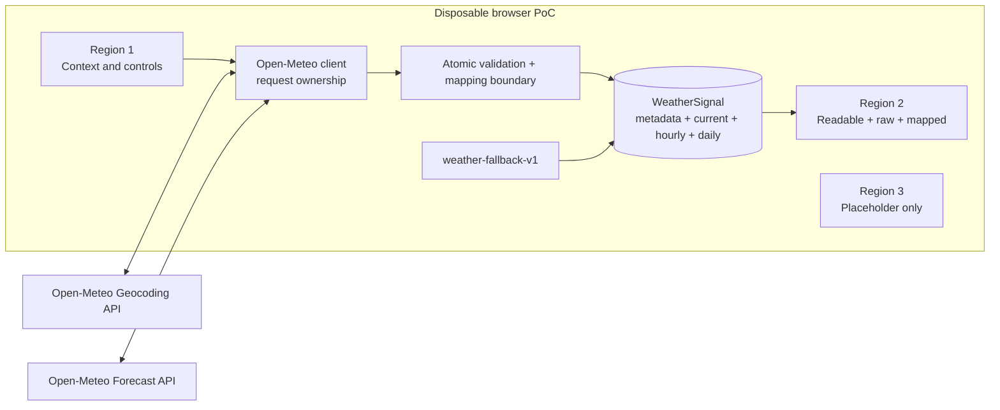

# ADR-002: Map Open-Meteo data into a bounded WeatherSignal in a browser PoC

**Status:** Proposed  
**Date:** 2026-07-21  
**Deciders:** Workshop participant and workshop facilitator

## Context

The workshop needs a disposable proof of concept that demonstrates an architecture boundary, not production architecture. A participant must search for a public location, fetch current plus 24-hour and seven-day weather evidence from Open-Meteo, validate it, and inspect both the provider payload and a normalized application contract.

The browser receives an external payload that can fail transport, parsing, shape, unit, time, and array-alignment expectations. The design must also demonstrate fictional fallback without presenting it as successful live evidence. Constraints prohibit a backend, persistence, runtime libraries, internal data, and operational authority.

The decision is scoped as follows:

## Decision

Map public Open-Meteo weather data into a bounded, atomic, provenance-carrying `WeatherSignal` in a stateless browser application with no backend.

The browser will:

1. Require explicit selection from cancellable Open-Meteo geocoding results.
2. Make one explicit-unit Forecast API request for current, hourly, and daily fields.
3. Preserve the exact received forecast payload separately for raw inspection.
4. Validate all required fields, units, times, finite values, and aligned cardinalities before emitting a live signal.
5. Emit no partial live signal and never repair provider values with fixture values.
6. Model `WeatherSignal` with top-level `metadata`, `current`, `hourly`, and `daily` sections.
7. Carry schema version, evidence mode, production time, unit system, location, timezone, and source provenance in metadata.
8. Treat automatic fictional fallback as a visible failure state with a versioned local fixture, retained failure context, and Retry.
9. Keep readable weather, raw response, mapped object, and advisory semantics distinct.
10. Hold all state in page memory so reload is a hard reset.

Fallback timestamps use the selected geocoding timezone. If it is missing or invalid, fallback uses UTC and records/displays that substitution. The browser timezone is never borrowed.

Advisory remains outside `WeatherSignal`. Its implementation is gated on a facilitator-approved versioned rule table and cannot create operational authority.

## Options considered

### Option A: Bounded client-side WeatherSignal (chosen)

| Dimension | Assessment |
| --- | --- |
| Complexity | Medium: explicit validator, mapper, provenance, and state machine |
| Cost | Low runtime/infrastructure cost; workshop implementation effort only |
| Scalability | Appropriate only for one participant/browser session |
| Team familiarity | Plain browser APIs and JavaScript |
| Failure transparency | High when labels and atomic states are implemented |

**Pros:** Makes the provider/application boundary visible; no infrastructure; raw and mapped data are easy to compare; deterministic tests can exercise mapping and failures; provenance travels with the object.

**Cons:** Browser owns API/race/time handling; strict validation may reject usable partial data; no centralized policy or observability; not suitable as a production integration boundary.

### Option B: Render the raw Open-Meteo response directly

| Dimension | Assessment |
| --- | --- |
| Complexity | Low initially |
| Cost | Lowest implementation effort |
| Scalability | Provider shape leaks to every consumer |
| Team familiarity | Simple JSON/property access |
| Failure transparency | Low; partial and malformed payload handling becomes ad hoc |

**Pros:** Fastest demo; no mapping layer.

**Cons:** Does not teach a bounded contract; couples UI to provider naming/arrays; provenance and cardinality guarantees remain implicit; raw, readable, and application semantics collapse together.

### Option C: Add a backend adapter

| Dimension | Assessment |
| --- | --- |
| Complexity | High for this exercise |
| Cost | Adds runtime, deployment, and maintenance |
| Scalability | Better future centralization potential |
| Team familiarity | Introduces an unnecessary second runtime |
| Failure transparency | Can centralize policy but obscures the browser-only learning objective |

**Pros:** Centralized validation, caching, secrets, observability, and versioning could support a real system.

**Cons:** Violates constraints; adds no value for a public unauthenticated workshop fetch; suggests production architecture prematurely.

### Option D: Permit partial WeatherSignal values

| Dimension | Assessment |
| --- | --- |
| Complexity | High downstream null/error handling |
| Cost | Lower rejection rate, higher consumer cost |
| Scalability | Weak contract propagates ambiguity |
| Team familiarity | Familiar best-effort rendering pattern |
| Failure transparency | Low; “success” no longer guarantees completeness |

**Pros:** Can display some provider values during partial defects.

**Cons:** Defeats the bounded-contract lesson; every consumer must revalidate; array alignment becomes unsafe; fallback/live boundaries blur.

### Option E: Persist controls or the last evidence

| Dimension | Assessment |
| --- | --- |
| Complexity | Medium due to staleness, migration, and provenance rules |
| Cost | Unnecessary phase scope |
| Scalability | Local-only persistence does not solve shared use |
| Team familiarity | Browser storage is familiar |
| Failure transparency | Restored evidence can look current without careful labeling |

**Pros:** Convenience across reloads.

**Cons:** Requires retention and stale-evidence semantics absent from the exercise; conflicts with hard-reset reviewability.

### Option F: Explicit fallback action instead of automatic fallback

| Dimension | Assessment |
| --- | --- |
| Complexity | Low |
| Cost | One additional user decision |
| Scalability | Not relevant |
| Team familiarity | Conventional recovery pattern |
| Failure transparency | Very high |

**Pros:** Strongest separation between failure and fictional data.

**Cons:** Reduces workshop continuity when the live service fails. The grill chose automatic fallback with stronger labeling and provenance.

Other rejected variants include choosing the first geocoding match, keeping old evidence during loading, using API-default units/timezone, attaching provenance only to UI state, assigning a fixed fictional place, and allowing the participant or agent to invent advisory thresholds.

## Trade-off analysis

The chosen design accepts more client-side validation and state-machine work to make a single teaching boundary explicit. It optimizes for inspectability and semantic honesty rather than availability or reuse. Automatic fallback is the riskiest trade-off: it preserves the workshop demonstration but can associate invented values with a selected real place. That risk is accepted only with `fictional-fallback` metadata, a local source kind, a fixture version, retained failure context, non-success styling/copy, and an explicit statement that values are not actual weather for the place.

Strict atomic validation favors contract trust over partial availability. Statelessness favors repeatable review over convenience. A browser adapter favors workshop scope over production centralization. None of these choices should be extrapolated into an operational architecture.

## Consequences

### Positive

- Consumers can rely on every emitted `WeatherSignal` being complete and unit-explicit.
- Live and fictional evidence remain machine- and human-distinguishable.
- Raw provider data remains available for inspection without becoming the application contract.
- Current, hourly, and daily data share one request context.
- Request races, refetches, and reloads have simple ownership rules.
- The exercise needs no infrastructure or runtime dependency.

### Negative

- The client must implement strict validation, timezone handling, cancellation, and latest-request ownership.
- Valid but incomplete provider responses are rejected in full.
- Automatic fallback still requires unusually prominent qualification.
- There is no persistence, offline history, centralized monitoring, or cross-client reuse.
- Pressure remains hPa under both unit systems.
- Advisory acceptance remains blocked until the facilitator supplies its rule table.

### Risks and mitigations

- **Fallback mistaken for live:** persistent visible label, failure context, Retry, provenance metadata, and no success language.
- **Real place mistaken as fixture source:** copy states the place is display context and values are not actual weather there.
- **Raw payload treated as trusted:** only the mapped object crosses the validation boundary.
- **Late response overwrites newer intent:** abort superseded requests and check active-attempt identity before every state update.
- **Missing fallback timezone:** substitute UTC, record offset 0, and disclose why.
- **Advisory gains authority:** keep it outside the contract and block weather-derived advice until facilitator approval.

## Action items

1. [ ] Participant implements the weather-only plan and records automated/manual review evidence.
2. [ ] Participant demonstrates live, rejected-payload, no-payload fallback, race, reload, keyboard, and 320-pixel paths.
3. [ ] Facilitator reviews provenance, fallback labels, contract shape, and scope.
4. [ ] Facilitator supplies and approves a versioned advisory rule table before advisory implementation/final acceptance.
5. [ ] Deciders either accept this ADR for the workshop PoC or revise it; Proposed status grants no production approval.

## Revisit triggers

Revisit before adding persistence, caching, another source, deployment, a backend, a consumer outside this page, schema evolution, real operational data/advice, autonomous action, or any production/security/reliability claim.
