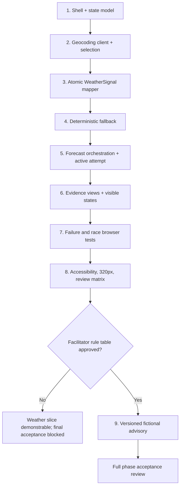

# Weather Workshop PoC Implementation Plan

> **For agentic workers:** REQUIRED SUB-SKILL: Use superpowers:subagent-driven-development (recommended) or superpowers:executing-plans to implement this plan task-by-task. Steps use checkbox (`- [ ]`) syntax for tracking.

**Goal:** Build a disposable browser PoC that searches public locations, fetches Open-Meteo current/hourly/daily weather, maps it atomically into `WeatherSignal`, and presents readable, raw, mapped, fallback, and failure evidence without a backend.

**Architecture:** Keep network access, contract validation/mapping, fallback construction, UI state, and rendering in focused ES modules. The controller owns one active attempt and is the only module allowed to transition weather state; `weather-signal.js` is a pure boundary that either returns a complete signal or throws. The browser ships no third-party runtime code.

**Tech Stack:** HTML5, CSS, browser ES modules, Fetch API, `AbortController`, `Intl.DateTimeFormat`, Node.js 22+ built-in test runner, Playwright 1.55+ as a development-only test dependency.

## Global constraints

- Plain HTML, CSS, and JavaScript; no application framework, backend, database, authentication, analytics, persistence, service worker, or deployment work.
- No runtime third-party or CDN libraries.
- Open-Meteo geocoding and forecast APIs are the only remote sources.
- Reload is a hard reset; metric is the only default control value.
- Use the exact glossary vocabulary in `plans/glossary_v2.md`.
- A live `WeatherSignal` is complete or absent; no partial mapping or fixture repair is allowed.
- Advisory is outside `WeatherSignal` and emits no weather-derived advice until a facilitator-approved rule table exists.
- Every control has an accessible name, focus is visible, status changes are announced, and 320 CSS pixels has no page-level horizontal overflow.

## External gate

The facilitator-approved advisory rule table is not present. Tasks 1-8 implement the complete weather evidence slice and a non-derived advisory gate message. Task 9 may execute only after the facilitator supplies a versioned artifact containing exact thresholds, precedence, copy, unit handling, and fallback behavior. Final product acceptance remains blocked until Task 9 passes; no task may invent those rules.

## File structure

```text
index.html                         Page shell, three regions, live region, controls
styles.css                        Responsive layout, focus, state/evidence styling
package.json                      Node test and Playwright development commands
playwright.config.js              Local static server and browser configuration
src/api.js                        Open-Meteo URL construction and cancellable fetches
src/app.js                        Event wiring, active-attempt ownership, transitions
src/state.js                      State factory and reducer-like transition functions
src/weather-signal.js             Pure atomic live validator/mapper
src/fallback.js                   Pure weather-fallback-v1 builder and unit conversion
src/advisory.js                   Rule-gated advisory interface outside WeatherSignal
src/render.js                     Accessible DOM rendering from state
tests/fixtures/geocoding.json     Deterministic geocoding success payload
tests/fixtures/forecast.json      Deterministic valid forecast payload with >24 hours
tests/state.test.js               Legal state transitions and stale-attempt rejection
tests/api.test.js                 URL parameters and API error normalization
tests/weather-signal.test.js      Contract, units, time slicing, malformed payloads
tests/fallback.test.js            Determinism, provenance, timezone and UTC substitution
tests/advisory.test.js            Gate behavior and later approved-rule behavior
tests/weather.spec.js             End-to-end controls, views, failures, races, a11y, width
```

## Implementation flow



### Task 1: Establish the page shell and explicit state model

**Files:**
- Create: `package.json`
- Create: `index.html`
- Create: `styles.css`
- Create: `src/state.js`
- Create: `src/app.js`
- Create: `src/render.js`
- Create: `tests/state.test.js`

**Interfaces:**
- Produces: `createInitialState(): AppState`
- Produces: `beginWeatherAttempt(state, attemptId): AppState`
- Produces: `settleWeatherAttempt(state, attemptId, outcome): AppState`
- Produces: `render(root, state): void`
- State weather kind is exactly `empty | loading | success | fallback | error`.
- A **Superseded request** is ignored by attempt ID and never becomes fallback or error.

- [ ] **Step 1: Add the test and browser toolchain**

Create `package.json`:

```json
{
  "name": "weather-workshop-poc",
  "private": true,
  "type": "module",
  "scripts": {
    "test": "node --test tests/*.test.js",
    "test:browser": "playwright test",
    "test:all": "npm test && npm run test:browser"
  },
  "devDependencies": {
    "@playwright/test": "^1.55.0"
  }
}
```

Run: `npm install`  
Expected: dependencies install and no runtime `dependencies` entry is added.

- [ ] **Step 2: Write failing state-transition tests**

Create `tests/state.test.js`:

```js
import test from "node:test";
import assert from "node:assert/strict";
import {
  beginWeatherAttempt,
  createInitialState,
  settleWeatherAttempt,
} from "../src/state.js";

test("hard-reset state has metric units and no selected context or evidence", () => {
  assert.deepEqual(createInitialState(), {
    query: "",
    search: { kind: "idle", results: [], message: "" },
    selectedLocation: null,
    scenario: "",
    unitSystem: "metric",
    activeAttemptId: null,
    weather: { kind: "empty" },
    activeView: "readable",
  });
});

test("begin clears prior evidence and stale settlement is ignored", () => {
  const oldSuccess = {
    ...createInitialState(),
    activeAttemptId: 1,
    weather: { kind: "success", signal: { metadata: {} }, raw: {} },
  };
  const loading = beginWeatherAttempt(oldSuccess, 2);
  assert.deepEqual(loading.weather, { kind: "loading" });
  assert.equal(loading.activeAttemptId, 2);
  assert.equal(
    settleWeatherAttempt(loading, 1, { kind: "error", message: "late" }),
    loading,
  );
});
```

Run: `npm test -- tests/state.test.js`  
Expected: FAIL because `src/state.js` does not exist.

- [ ] **Step 3: Implement the state boundary**

Create `src/state.js`:

```js
export function createInitialState() {
  return {
    query: "",
    search: { kind: "idle", results: [], message: "" },
    selectedLocation: null,
    scenario: "",
    unitSystem: "metric",
    activeAttemptId: null,
    weather: { kind: "empty" },
    activeView: "readable",
  };
}

export function beginWeatherAttempt(state, attemptId) {
  return { ...state, activeAttemptId: attemptId, weather: { kind: "loading" } };
}

export function settleWeatherAttempt(state, attemptId, outcome) {
  if (state.activeAttemptId !== attemptId) return state;
  return { ...state, activeAttemptId: null, weather: outcome };
}
```

Run: `npm test -- tests/state.test.js`  
Expected: PASS (2 tests).

- [ ] **Step 4: Add semantic shell markup and baseline rendering**

Create `index.html` with one `main`, a labeled Region 1 form, Region 2 status/evidence containers, Region 3 placeholder, and `<p id="status" class="sr-only" aria-live="polite"></p>`. Use native radio inputs for scenario/units, `<input role="combobox" aria-controls="location-results" aria-expanded="false">`, `<ul role="listbox">`, and `<button type="submit" disabled>Fetch weather</button>`. Load `src/app.js` as `type="module"`.

Create `src/render.js`:

```js
export function render(root, state) {
  root.dataset.weatherState = state.weather.kind;
  const fetchButton = root.querySelector("#fetch-weather");
  fetchButton.disabled =
    !state.selectedLocation || !state.scenario || state.weather.kind === "loading";
  root.querySelector("#status").textContent = statusMessage(state);
}

function statusMessage(state) {
  if (state.weather.kind === "loading") return "Fetching live weather.";
  if (state.weather.kind === "success") return "Live weather loaded.";
  if (state.weather.kind === "fallback") return "Live fetch failed. Fictional fallback data shown.";
  if (state.weather.kind === "error") return state.weather.message;
  return "Select a location and fictional scenario to fetch weather.";
}
```

Create `src/app.js`:

```js
import { createInitialState } from "./state.js";
import { render } from "./render.js";

const root = document.querySelector("#weather-app");
let state = createInitialState();
render(root, state);
```

Create `styles.css` with `box-sizing: border-box`, a one-column mobile layout, a two-column Region 1/2 layout above `48rem`, visible `:focus-visible` outlines, `.sr-only`, text wrapping, `pre { overflow: auto; max-width: 100%; }`, and evidence styles keyed by `data-weather-state` that do not rely on color alone.

Run: `npm test`  
Expected: PASS (2 tests).

- [ ] **Step 5: Commit the stateful shell**

```bash
git add package.json package-lock.json index.html styles.css src/state.js src/app.js src/render.js tests/state.test.js
git commit -m "feat: establish weather workshop shell"
```

### Task 2: Implement cancellable location search and explicit selection

**Files:**
- Create: `src/api.js`
- Create: `tests/api.test.js`
- Create: `tests/fixtures/geocoding.json`
- Modify: `src/app.js`
- Modify: `src/render.js`

**Interfaces:**
- Produces: `buildGeocodingUrl(query): URL`
- Produces: `searchLocations(query, signal): Promise<SelectedLocation[]>`
- `SelectedLocation` contains `geocodingId`, `name`, `admin1`, `country`, `latitude`, `longitude`, and `timezone: string | null`.

- [ ] **Step 1: Write URL and normalization tests**

Create `tests/api.test.js` asserting that `buildGeocodingUrl(" Portland ")` uses `https://geocoding-api.open-meteo.com/v1/search`, `name=Portland`, `count=5`, `language=en`, and `format=json`. Mock `globalThis.fetch` to verify non-OK responses throw `ApiError` with kind `http`, invalid JSON throws kind `parse`, abort remains an `AbortError`, and a successful result normalizes absent `admin1`/timezone to `null`.

Run: `npm test -- tests/api.test.js`  
Expected: FAIL because the API module does not exist.

- [ ] **Step 2: Implement geocoding URL and errors**

Create `src/api.js` with:

```js
export class ApiError extends Error {
  constructor(kind, message, payload = null) {
    super(message);
    this.name = "ApiError";
    this.kind = kind;
    this.payload = payload;
  }
}

export function buildGeocodingUrl(query) {
  const url = new URL("https://geocoding-api.open-meteo.com/v1/search");
  url.search = new URLSearchParams({
    name: query.trim(), count: "5", language: "en", format: "json",
  });
  return url;
}

export async function searchLocations(query, signal) {
  let response;
  try {
    response = await fetch(buildGeocodingUrl(query), { signal });
  } catch (error) {
    if (error.name === "AbortError") throw error;
    throw new ApiError("network", "Location search could not reach Open-Meteo.");
  }
  if (!response.ok) throw new ApiError("http", `Location search failed (${response.status}).`);
  let body;
  try { body = await response.json(); }
  catch { throw new ApiError("parse", "Location search returned unreadable data."); }
  return (body.results ?? []).map((item) => ({
    geocodingId: Number.isInteger(item.id) ? item.id : null,
    name: item.name,
    admin1: item.admin1 ?? null,
    country: item.country,
    latitude: item.latitude,
    longitude: item.longitude,
    timezone: typeof item.timezone === "string" ? item.timezone : null,
  }));
}
```

Run: `npm test -- tests/api.test.js`  
Expected: PASS.

- [ ] **Step 3: Wire the 300 ms combobox flow**

In `src/app.js`, add one search `AbortController`, one debounce timer, and one monotonically increasing search ID. On input: clear the selected location; for fewer than two trimmed characters, abort/clear and render idle; otherwise wait 300 ms, mark search loading, call `searchLocations`, and update state only when the ID is still current. Ignore `AbortError`; render network/HTTP/parse failures in the search status only. Use event delegation on `[role=option]` to store the exact normalized result and copy its display label into the input.

In `src/render.js`, render at most five options with stable IDs and text `name, admin1, country` (omitting absent `admin1`), update `aria-expanded` and `aria-activedescendant`, and support ArrowDown, ArrowUp, Enter, and Escape from `src/app.js`.

Run: `npm test`  
Expected: all API and state tests pass.

- [ ] **Step 4: Commit geocoding**

```bash
git add src/api.js src/app.js src/render.js tests/api.test.js tests/fixtures/geocoding.json
git commit -m "feat: add explicit public location selection"
```

### Task 3: Build the atomic live WeatherSignal boundary

**Files:**
- Create: `src/weather-signal.js`
- Create: `tests/weather-signal.test.js`
- Create: `tests/fixtures/forecast.json`

**Interfaces:**
- Produces: `mapLiveWeather(raw, selectedLocation, unitSystem, producedAt): WeatherSignal`
- Throws: `ContractError` with stable `code` values such as `missing-field`, `invalid-number`, `invalid-time`, `invalid-unit`, `misaligned-array`, and `insufficient-range`.

- [ ] **Step 1: Add a complete valid fixture and contract test**

Create `tests/fixtures/forecast.json` using exact Open-Meteo snake-case keys, units, timezone, UTC offset, one current record, at least 25 ordered hourly records, and seven daily records. Use fixed times around `2026-07-21T10:00`.

Create `tests/weather-signal.test.js` that imports the fixture and asserts:

```js
const signal = mapLiveWeather(raw, location, "metric", "2026-07-21T09:00:00.000Z");
assert.deepEqual(Object.keys(signal), ["metadata", "current", "hourly", "daily"]);
assert.equal(signal.metadata.evidenceMode, "live");
assert.equal(signal.metadata.source.kind, "open-meteo");
assert.equal(signal.metadata.source.fixtureId, null);
assert.equal(signal.hourly.time.length, 24);
assert.equal(signal.daily.date.length, 7);
assert.equal(signal.current.isDay, true);
assert.equal(signal.current.units.surfacePressure, "hPa");
```

Run: `npm test -- tests/weather-signal.test.js`  
Expected: FAIL because the mapper does not exist.

- [ ] **Step 2: Implement validators and exact key mapping**

Create `src/weather-signal.js` with `ContractError`, helpers `requiredObject`, `requiredArray`, `finiteNumber`, `requiredString`, `assertParallelLengths`, `assertOrderedTimes`, `assertKnownUnit`, and `sliceHourlyFromCurrentHour`. Map explicit provider keys to the camelCase contract. Construct metadata from forecast timezone/offset and selected geocoding location; set `schemaVersion: "1.0"`, `evidenceMode: "live"`, and live source provenance.

The implementation must validate all fields before returning. Build into a local `signal` only after validation completes; do not mutate UI state or catch `ContractError` here.

Run: `npm test -- tests/weather-signal.test.js`  
Expected: the valid mapping test passes.

- [ ] **Step 3: Add table-driven atomic rejection tests**

Add cloned-fixture cases for missing blocks, missing units, `null`, `NaN`, infinity, out-of-range coordinates, `is_day=2`, malformed/unordered current and forecast times, unequal hourly arrays, unequal daily arrays, fewer than 24 eligible hours, fewer than seven days, and unknown temperature/precipitation/wind/pressure units. For every case assert `ContractError` and assert no returned partial signal exists.

Add one imperial fixture variant asserting °F, inch, mph, and hPa are accepted and preserved.

Run: `npm test -- tests/weather-signal.test.js`  
Expected: all valid and invalid contract cases pass.

- [ ] **Step 4: Commit the contract boundary**

```bash
git add src/weather-signal.js tests/weather-signal.test.js tests/fixtures/forecast.json
git commit -m "feat: map atomic WeatherSignal contract"
```

### Task 4: Build deterministic, provenance-safe fallback

**Files:**
- Create: `src/fallback.js`
- Create: `tests/fallback.test.js`

**Interfaces:**
- Produces: `buildFallbackSignal(selectedLocation, unitSystem, producedAt): WeatherSignal`
- Uses fixture ID `weather-fallback-v1`.
- Returns `metadata.timezone.substitutionReason: string | null` so UTC substitution is inspectable.

- [ ] **Step 1: Write deterministic fallback tests**

Test same inputs yield deep-equal output; metric/imperial values use the specified units; hourly/daily arrays have 24/7 aligned entries; source is `workshop-fixture`; mode is `fictional-fallback`; and `failedLiveAttempt` is true. Test `America/Los_Angeles` produces that timezone and a computed integer offset. Test missing and invalid timezone inputs produce `name: "UTC"`, offset `0`, and substitution reason `Geocoding timezone unavailable; UTC used for fictional fallback.`

Run: `npm test -- tests/fallback.test.js`  
Expected: FAIL because the fallback builder does not exist.

- [ ] **Step 2: Implement the fixed fixture recipe**

Create `src/fallback.js`. Define one frozen metric sequence for all current, 24 hourly, and seven daily values. Anchor local labels to the hour containing `producedAt`, formatted in the validated selected timezone; catch `RangeError` from invalid IANA zones and substitute UTC. Convert temperatures with $F=C\times9/5+32$, millimeters with $in=mm/25.4$, and km/h with $mph=kmh/1.609344$. Round display values consistently and retain hPa unchanged.

Set fallback metadata exactly as required and keep the selected real place only in `metadata.location`. Do not construct a raw Open-Meteo payload.

Run: `npm test -- tests/fallback.test.js`  
Expected: all fallback tests pass.

- [ ] **Step 3: Add boundary tests for daylight-saving transitions**

Use fixed `producedAt` instants immediately before/after a DST transition and assert 24 ordered labels are generated without array misalignment. The labels may repeat a local clock hour during fall-back, but each entry must also carry an unambiguous ISO instant or offset-bearing timestamp.

Run: `npm test -- tests/fallback.test.js`  
Expected: all determinism, UTC substitution, and DST cases pass.

- [ ] **Step 4: Commit fallback**

```bash
git add src/fallback.js tests/fallback.test.js
git commit -m "feat: add fictional weather fallback"
```

### Task 5: Orchestrate the active forecast attempt

**Files:**
- Modify: `src/api.js`
- Modify: `src/app.js`
- Modify: `src/state.js`
- Modify: `tests/api.test.js`
- Modify: `tests/state.test.js`

**Interfaces:**
- Produces: `buildForecastUrl(location, unitSystem): URL`
- Produces: `fetchForecast(location, unitSystem, signal): Promise<object>`
- Controller outcome shapes:
  - success: `{ kind: "success", raw, signal }`
  - fallback: `{ kind: "fallback", failedRaw, failureMessage, signal }`
  - error: `{ kind: "error", message }`

- [ ] **Step 1: Write exact forecast URL tests**

Assert selected latitude/longitude, `timezone=auto`, `forecast_days=7`, all specified current/hourly/daily comma-separated fields, and unit parameters. Metric expects Celsius, millimeters, and km/h; imperial expects Fahrenheit, inch, and mph.

Run: `npm test -- tests/api.test.js`  
Expected: FAIL because forecast functions do not exist.

- [ ] **Step 2: Implement the forecast client**

Extend `src/api.js` with exact field constants, `buildForecastUrl`, and `fetchForecast`. Preserve a parsed payload on contract failures by letting the controller own mapping. Normalize transport/HTTP/parse errors to `ApiError`; do not convert aborts.

Run: `npm test -- tests/api.test.js`  
Expected: all geocoding and forecast client tests pass.

- [ ] **Step 3: Write active-attempt controller tests**

Extract and export `createWeatherController({ fetchForecast, mapLiveWeather, buildFallbackSignal, now, onState })` from `src/app.js`. With deferred promises, assert starting attempt 2 aborts attempt 1, clears evidence, and ignores attempt 1 even if it resolves later. Assert `AbortError` creates no fallback. Assert network/HTTP/parse/contract failures create fallback. Assert a payload rejected by mapping is retained as `failedRaw`; transport failure uses `failedRaw: null`; fallback-construction failure creates error with retry.

Run: `npm test -- tests/state.test.js`  
Expected: FAIL until the controller is extracted.

- [ ] **Step 4: Implement attempt ownership and outcomes**

In `src/app.js`, maintain one attempt counter and controller. Capture selected location, scenario, and units at submit; call `beginWeatherAttempt`; fetch one payload; map it; and settle only when the attempt remains active. On non-abort failure, call `buildFallbackSignal` with the same captured location/units and current produced-at instant. If fallback also throws, settle error. Retry invokes the same submit path with current controls.

Run: `npm test`  
Expected: all state, API, mapping, and fallback tests pass.

- [ ] **Step 5: Commit orchestration**

```bash
git add src/api.js src/app.js src/state.js tests/api.test.js tests/state.test.js
git commit -m "feat: orchestrate active weather attempts"
```

### Task 6: Render three evidence views and all visible states

**Files:**
- Create: `src/advisory.js`
- Create: `tests/advisory.test.js`
- Modify: `index.html`
- Modify: `src/render.js`
- Modify: `src/app.js`
- Modify: `styles.css`

**Interfaces:**
- Produces: `createAdvisory(signal, scenario, approvedRuleTable): AdvisoryResult`
- Before rule approval, returns `{ kind: "blocked", message: "Facilitator-approved advisory rules are unavailable." }` without reading weather fields.
- Renderer uses `textContent` for all raw/mapped JSON and provider/user strings.

- [ ] **Step 1: Test the advisory gate**

Create `tests/advisory.test.js`:

```js
import test from "node:test";
import assert from "node:assert/strict";
import { createAdvisory } from "../src/advisory.js";

test("emits no derived advice without an approved rule table", () => {
  assert.deepEqual(createAdvisory({ current: { temperature: 999 } }, "warehouse-planning", null), {
    kind: "blocked",
    message: "Facilitator-approved advisory rules are unavailable.",
  });
});
```

Run: `npm test -- tests/advisory.test.js`  
Expected: FAIL because `src/advisory.js` does not exist.

- [ ] **Step 2: Implement only the approved-rule gate**

Create `src/advisory.js`:

```js
export function createAdvisory(_signal, _scenario, approvedRuleTable) {
  if (!approvedRuleTable) {
    return {
      kind: "blocked",
      message: "Facilitator-approved advisory rules are unavailable.",
    };
  }
  throw new Error("Approved advisory rule-table adapter is not installed.");
}
```

Run: `npm test -- tests/advisory.test.js`  
Expected: PASS and no weather-derived advisory exists.

- [ ] **Step 3: Render empty, loading, success, fallback, and error**

Extend `index.html` with three native buttons controlling panels `readable`, `raw`, and `mapped`; use `aria-pressed` or a correct tab pattern. Include `details` for raw/mapped content, collapsed by default.

Extend `src/render.js` so:

- empty renders instructional status but no evidence;
- loading renders text and clears evidence nodes;
- success renders provenance, current, 24 hourly, seven daily, exact raw JSON, and mapped JSON;
- fallback renders the four mandatory statements, UTC substitution statement when applicable, Retry, fictional signal, and either Failed live response JSON or “No response payload was received.”;
- error renders one alert and Retry with no evidence;
- advisory always has the label **Fictional workshop advisory — not operational guidance** and the blocked message until Task 9.

Build DOM with `createElement` and `textContent`; do not interpolate provider/user strings into `innerHTML`.

Run: `npm test`  
Expected: every unit test passes.

- [ ] **Step 4: Style evidence modes and stable responsive panels**

In `styles.css`, add text labels/icons independent of color, stable grids with `minmax(0, 1fr)`, wrapping for location/timestamps, bounded JSON viewers, and `@media (prefers-reduced-motion: reduce)`. Ensure controls have at least 44 CSS-pixel targets and no fixed widths wider than their container.

- [ ] **Step 5: Commit evidence rendering**

```bash
git add index.html styles.css src/advisory.js src/app.js src/render.js tests/advisory.test.js
git commit -m "feat: render weather evidence and failure states"
```

### Task 7: Verify live, fallback, failure, and race behavior in a browser

**Files:**
- Create: `playwright.config.js`
- Create: `tests/weather.spec.js`

**Interfaces:**
- Browser tests intercept only the two Open-Meteo hosts.
- Tests use fixture payloads and never depend on public network availability.

- [ ] **Step 1: Configure a static test server**

Create `playwright.config.js`:

```js
import { defineConfig } from "@playwright/test";

export default defineConfig({
  testDir: "./tests",
  use: { baseURL: "http://127.0.0.1:4173" },
  webServer: {
    command: "python3 -m http.server 4173 --bind 127.0.0.1",
    url: "http://127.0.0.1:4173",
    reuseExistingServer: true,
  },
});
```

Run: `npx playwright install chromium`  
Expected: Chromium installs successfully.

- [ ] **Step 2: Write the live success journey**

In `tests/weather.spec.js`, intercept geocoding and forecast with the fixtures. Drive the UI by accessible roles: enter Portland, wait for and select a disambiguated option, select warehouse planning, retain metric, submit, and assert one forecast request includes all three variable groups. Assert success text, 24 hourly entries, seven daily entries, raw Open-Meteo JSON, mapped `evidenceMode: live`, and blocked advisory copy.

Run: `npm run test:browser -- --grep "live success"`  
Expected: PASS.

- [ ] **Step 3: Add every failure-path browser test**

Add named tests for:

- geocoding no-results, network abort, HTTP 500, and malformed JSON;
- a new query superseding a delayed old query;
- forecast network failure, HTTP 500, malformed JSON, and contract-invalid payload;
- rejected payload visible only under Failed live response;
- no-payload fallback saying no response payload was received;
- missing geocoding timezone producing/disclosing UTC fallback;
- late older forecast ignored after a newer attempt;
- refetch clearing prior evidence while loading;
- fallback builder failure simulated through an injectable test hook producing error with retry;
- Retry starting a fresh request;
- reload restoring empty query/location/scenario/evidence and metric units.

For fallback cases, assert all mandatory fictional/failure statements and assert the page does not contain “Live weather loaded.”

Run: `npm run test:browser`  
Expected: all browser state/failure tests pass.

- [ ] **Step 4: Commit browser behavior tests**

```bash
git add playwright.config.js tests/weather.spec.js
git commit -m "test: cover weather evidence failure paths"
```

### Task 8: Complete accessibility, responsive, and facilitator review evidence

**Files:**
- Modify: `tests/weather.spec.js`
- Modify: `styles.css`
- Create: `plans/review-matrix_v2.md`

**Interfaces:**
- Produces review evidence; no new product behavior.

- [ ] **Step 1: Add keyboard and announcement tests**

Use only keyboard presses to focus the combobox, traverse options, select, choose scenario/units, fetch, switch evidence views, expand JSON, and retry. Assert focus visibility via computed outline/box-shadow, combobox attributes, expanded state, and exact live-region messages. Assert one failure alert is exposed, not duplicate alert/live announcements.

Run: `npm run test:browser -- --grep "keyboard|announcement"`  
Expected: keyboard journey and status assertions pass.

- [ ] **Step 2: Add 320-pixel overflow and content-fit tests**

Set viewport to 320 by 800, use an intentionally long place/admin/country, show fallback and expanded JSON, and assert `document.documentElement.scrollWidth <= document.documentElement.clientWidth`. Assert JSON viewer owns any horizontal scroll and interactive text remains inside each control's bounding box.

Run: `npm run test:browser -- --grep "320"`  
Expected: no page-level overflow.

- [ ] **Step 3: Run complete automated validation**

Run: `npm run test:all`  
Expected: every Node and Playwright test passes with zero failed tests.

- [ ] **Step 4: Record the participant self-check matrix**

Create `plans/review-matrix_v2.md` with rows for keyboard-only use, 320-pixel layout, live success, no results, geocoding failures, forecast failures, malformed/unaligned payload, rejected/no raw payload, UTC substitution, retry, request race, refetch clearing, metric/imperial, fallback labels, advisory gate, and reload hard reset. Columns are `Check`, `Automated evidence`, `Manual observation`, `Participant result`, and `Facilitator result`. Use `Not reviewed` as the initial review value, not an implied pass.

- [ ] **Step 5: Commit verification evidence**

```bash
git add styles.css tests/weather.spec.js plans/review-matrix_v2.md
git commit -m "test: verify accessible responsive weather flow"
```

### Task 9: Integrate the facilitator-approved advisory rule table

**Execution condition:** The facilitator has supplied and signed off a concrete, versioned rule-table artifact. If this condition is false, stop after Task 8 and report final acceptance blocked. Do not create substitute thresholds or copy.

**Files:**
- Create: `src/advisory-rules-v1.js` from the approved artifact
- Modify: `src/advisory.js`
- Modify: `src/app.js`
- Modify: `tests/advisory.test.js`
- Modify: `tests/weather.spec.js`
- Modify: `plans/review-matrix_v2.md`

**Interfaces:**
- Produces: approved `ADVISORY_RULE_TABLE` with `version`, scenario rules, unit behavior, precedence, exact copy, and fallback behavior.
- Produces: `createAdvisory(signal, scenario, ADVISORY_RULE_TABLE): { kind: "advisory", version, message }`.

- [ ] **Step 1: Transcribe the approved artifact exactly and test its schema**

Write a failing test that asserts the facilitator-supplied version and every required scenario/unit/evidence-mode branch exist. Use the approved values verbatim; the expected values come from the signed artifact, not this plan.

Run: `npm test -- tests/advisory.test.js`  
Expected: FAIL because the approved module is not yet connected.

- [ ] **Step 2: Implement deterministic precedence evaluation**

Update `createAdvisory` to reject an unapproved/malformed table, normalize comparisons to canonical metric quantities where the approved artifact requires it, evaluate rules in the approved precedence order, and return only approved copy plus its version. Keep all command/action verbs prohibited by the specification.

Run: `npm test -- tests/advisory.test.js`  
Expected: every approved-rule, unit-equivalence, precedence, and fallback-mode case passes.

- [ ] **Step 3: Render and verify approved advisory output**

Inject `ADVISORY_RULE_TABLE` from `src/app.js`. Extend browser tests for both scenarios, both unit systems, live/fallback modes, rule version visibility, exact approved copy, and separation from raw/mapped evidence.

Run: `npm run test:all`  
Expected: all tests pass, including advisory cases.

- [ ] **Step 4: Complete facilitator acceptance and commit**

Record facilitator results in `plans/review-matrix_v2.md`, then run:

```bash
git add src/advisory-rules-v1.js src/advisory.js src/app.js tests/advisory.test.js tests/weather.spec.js plans/review-matrix_v2.md
git commit -m "feat: add approved fictional advisory rules"
```

## Final self-review checklist

- [ ] Every P0 requirement in `plans/spec_v2.md` maps to Tasks 1-9 or the explicit advisory gate.
- [ ] All geocoding, forecast, mapping, fallback, application-defect, abort, race, retry, and reload paths have named tests.
- [ ] Raw response, mapped object, readable weather, and advisory remain distinct.
- [ ] `WeatherSignal` names and cardinalities match across implementation and tests.
- [ ] No fixture is presented as a raw Open-Meteo response.
- [ ] No application state survives reload.
- [ ] No runtime dependency or non-Open-Meteo remote source is introduced.
- [ ] Final acceptance is not claimed before facilitator advisory approval.
