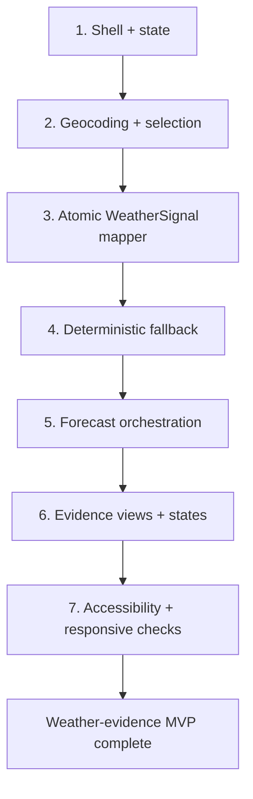

# Weather Workshop PoC Implementation Plan

**Status:** APPROVED for weather-evidence MVP. Advisory remains a Later phase.

**Goal:** Build a disposable browser PoC that searches public locations, fetches Open-Meteo current/hourly/daily weather, maps it atomically into `WeatherSignal`, and presents readable, raw, mapped, fallback, and failure evidence without a backend.

**Architecture:** One `app/index.html`, one `app/styles.css`, one `app/app.js` with plain scripts (no ES modules, no imports). If the file grows too large, split into `app/js/` with normal script tags after obtaining human approval. The controller owns one active attempt. `weather-signal.js` is a pure boundary that either returns a complete signal or throws. The browser ships no third-party runtime code.

**Tech Stack:** HTML5, CSS, plain JavaScript (no modules, no imports), Fetch API, `AbortController`. Tests use `node:test` with `require()` for pure modules. No npm dependencies, no Playwright, no package manifest. Browser checks are manual or use the repository verifier.

**Execution boundary:** This plan is for the `course/day-3/` checkpoint folders. The planning artifacts (spec, ADR, plan, glossary) stay in the Day 2 folder. Implementation happens in `course/day-3/starter/`, `cp1/`, `cp2/`, `cp3/`, and `finish/`.

## Risks

| # | Risk | Impact | Likelihood | Mitigation |
|---|------|--------|------------|------------|
| 1 | Open-Meteo CORS blocked from file:// | High | Medium | Use fictional fallback for the exercise; don't call fallback a live result |
| 2 | Hourly slice timezone/DST edge case | Medium | Low | Slice from current hour in the location's timezone; reject short arrays |
| 3 | Fallback confused with live evidence | High | Low | Visible labels, isFallback flag, distinct source URL |
| 4 | File too large for one app.js | Medium | Medium | Split into app/js/ with approval and INDEX.md if needed |
| 5 | Stale response overwrites newer state | High | Medium | AbortController + attempt ID; ignore old replies |
| 6 | Accessibility regressions | Medium | Low | Manual keyboard check at two widths; visible focus; live region |

## Global constraints

- Plain HTML, CSS, and JavaScript; no application framework, backend, database, authentication, analytics, persistence, service worker, or deployment work.
- No runtime third-party or CDN libraries.
- No npm dependencies, no package.json, no Playwright, no ES modules, no imports.
- Open-Meteo geocoding and forecast APIs are the only remote sources.
- Reload is a hard reset.
- A live `WeatherSignal` is complete or absent; no partial mapping or fixture repair is allowed.
- Every control has an accessible name, focus is visible, status changes are announced, and 320 CSS pixels has no page-level horizontal overflow.
- Every checkpoint step: verify first, review changed files, propose checkpoint, wait for human confirmation.

## File structure

```text
app/
  index.html                  Page shell, three regions, live region, controls
  styles.css                  Responsive layout, focus, state/evidence styling
  app.js                      Event wiring, active-attempt ownership, rendering
  weather-signal.js           Pure atomic live validator/mapper (loaded via script tag)
tests/
  weather-signal.test.mjs     Contract, units, time slicing, malformed payloads
```

If `app.js` grows too large, split into `app/js/` with normal script tags and an `INDEX.md` after obtaining human approval.

## Implementation flow



### Task 1: Establish the page shell and state model

**Depends on:** nothing  
**Files:**
- Modify: `app/index.html`
- Modify: `app/styles.css`
- Modify: `app/app.js`

**Steps:**

1. Open `app/index.html`. Confirm the three regions (controls, evidence, review placeholder) are present with headings and disabled buttons.
2. In `app/app.js`, add a simple state object: `{ query, search, selectedLocation, weather, activeAttemptId }` with `weather.kind` being `empty | loading | success | fallback | error`.
3. Add a `render(root, state)` function that updates the fetch button's disabled state and the status text based on `weather.kind`.
4. Add baseline `styles.css`: box-sizing, one-column mobile layout, visible focus outlines, sr-only class, text wrapping.

**Verify:** Open `app/index.html` in a browser. Confirm the three regions render, buttons are disabled, and the status says "Select a location to fetch weather."

**Checkpoint proposal:** Summarize changed files, suggest a message, wait for human confirmation.

### Task 2: Implement location search and selection

**Depends on:** Task 1  
**Files:**
- Modify: `app/app.js`
- Modify: `app/index.html`

**Steps:**

1. Add `buildSearchUrl(query)` that builds the Open-Meteo geocoding URL with `name`, `count=5`, `language=en`, `format=json`.
2. Add `searchLocations(query)` that fetches and normalizes results to `{ id, name, admin1, country, latitude, longitude, timezone }`.
3. Wire a 300ms debounce on the search input. Ignore queries shorter than 2 characters. Use an `AbortController` and a search ID so older responses are ignored.
4. Render results as keyboard-operable buttons. Announce loading, result count, empty, and errors.
5. On selection, store the location and enable the fetch button.

**Verify:** Type "Arlington", select Arlington Virginia. Type "zzzz", confirm "no results". Open Network panel, confirm only the geocoding endpoint was contacted.

**Checkpoint proposal:** Summarize changed files, suggest a message, wait for human confirmation.

### Task 3: Build the atomic live WeatherSignal mapper

**Depends on:** Task 2 (needs the selected location shape)  
**Files:**
- Create: `app/weather-signal.js` (loaded via script tag, exposes functions on `window`)
- Create: `tests/weather-signal.test.mjs`

**Steps:**

1. Write `tests/weather-signal.test.mjs` using `node:test` and `require()` for the mapper. Test with a valid fixture: assert the signal has `location`, `latitude`, `longitude`, `timezone`, `sourceUrl`, `isFallback: false`, `current` (with all fields and units), `hourly` (24 entries), `daily` (7 entries).
2. Implement `mapWeatherSignal(location, response, sourceUrl)` in `weather-signal.js`. Map Open-Meteo snake_case keys to camelCase. Validate every required field; throw on missing/null/non-finite values, short arrays, or unknown units.
3. Add table-driven rejection tests: missing fields, null, NaN, short hourly, short daily, unknown units.

**Verify:** Run `node --test tests/weather-signal.test.mjs`. All tests pass.

**Checkpoint proposal:** Summarize changed files, suggest a message, wait for human confirmation.

### Task 4: Build deterministic fallback

**Depends on:** Task 3 (needs the WeatherSignal shape)  
**Files:**
- Modify: `app/weather-signal.js` (or a new `app/fallback.js` loaded via script tag)
- Modify: `tests/weather-signal.test.mjs`

**Steps:**

1. Define `FALLBACK_SIGNAL` — a fixed fictional WeatherSignal with `isFallback: true`, `sourceUrl: 'bundled://fictional-weather-signal'`, location `Workshop Harbor, Fictional Coast`, and fictional current/hourly/daily values.
2. Test that the fallback is deterministic: same values every time, correct shape, `isFallback` is true.

**Verify:** Run `node --test tests/weather-signal.test.mjs`. All tests pass including fallback.

**Checkpoint proposal:** Summarize changed files, suggest a message, wait for human confirmation.

### Task 5: Orchestrate the active forecast attempt

**Depends on:** Tasks 2, 3, 4  
**Files:**
- Modify: `app/app.js`
- Modify: `app/weather-signal.js`

**Steps:**

1. Add `buildForecastUrl(location)` that builds the Open-Meteo forecast URL with `latitude`, `longitude`, `current`, `hourly`, `daily`, `forecast_days=7`, `timezone=auto`.
2. Add `fetchWeather(location)` that sends the request and returns the raw reply.
3. Wire the fetch button: on click, clear prior evidence, enter loading, fetch weather, map to WeatherSignal. On success, show evidence. On failure, do NOT auto-load fallback — show an error with a Retry button.
4. Use an attempt ID so a stale response is ignored if the user fetches again or changes the location.
5. Add a "Load fictional fallback" button that loads `FALLBACK_SIGNAL` explicitly. Never auto-load fallback after a live failure.

**Verify:** Search Arlington, select it, click Fetch weather. Confirm current, hourly, and daily cards render. Block the network (Developer Tools → Offline), click Fetch weather — confirm error + Retry, no auto-fallback. Click "Load fictional fallback" — confirm fake data appears, clearly labeled.

**Checkpoint proposal:** Summarize changed files, suggest a message, wait for human confirmation.

### Task 6: Render three evidence views and all visible states

**Depends on:** Task 5  
**Files:**
- Modify: `app/index.html`
- Modify: `app/app.js`
- Modify: `app/styles.css`

**Steps:**

1. Add three views in Region 2: a readable weather card, a collapsible raw JSON viewer, and a collapsible mapped WeatherSignal viewer.
2. Render each state: empty (instructional text), loading (clears evidence), success (all three views), fallback (fictional data + labels + retry), error (alert + retry, no evidence).
3. Use `textContent` for all JSON and provider strings — never `innerHTML`.
4. Add the "Fictional fallback data" label and the "Live weather loaded" label so the two are visibly distinct.
5. Style the evidence modes with text labels, not color alone. Add responsive grids with `minmax(0, 1fr)`.

**Verify:** Fetch live weather — confirm all three views show the same data in different forms. Load fallback — confirm the label says "Fictional fallback data" and no text says "Live weather loaded."

**Checkpoint proposal:** Summarize changed files, suggest a message, wait for human confirmation.

### Task 7: Accessibility, responsive, and final verification

**Depends on:** Task 6  
**Files:**
- Modify: `app/styles.css` (if needed)
- Modify: `app/app.js` (if needed)

**Steps:**

1. Keyboard-only test: Tab to search, type, Tab to results, Enter to select, Tab to Fetch weather, Enter to fetch, Tab to Load fallback, Enter. Confirm visible focus at every step.
2. 320px width test: open at 390x844 (phone). Confirm no horizontal scroll. Long place names wrap. JSON viewer scrolls within its own box.
3. Console check: Developer Tools → Console shows no red errors.
4. Source link: confirm the source URL points at the exact Open-Meteo address.
5. Reload: confirm all state clears (empty query, no selection, no evidence).
6. Run `node --check app/app.js` and `node --check app/weather-signal.js` for syntax.
7. Run `node --test tests/weather-signal.test.mjs` for the contract.

**Verify:** All checks pass. The weather app is complete.

**Checkpoint proposal:** Summarize changed files, suggest a message, wait for human confirmation.

## Implementation decision record

Record in `implementation/decisions.md` any decision made without direct human approval. For each entry:

- Decision
- Reason
- Alternatives considered
- Expected impact
- Whether human approval is still needed

Examples of decisions to record: debounce timing (300ms), search result count (5), fallback location name, file split if `app.js` grows too large.

## Final self-review checklist

- [ ] Every P0 requirement in `spec_v2.md` maps to a task above.
- [ ] All geocoding, forecast, mapping, fallback, abort, race, retry, and reload paths have been verified.
- [ ] Raw response, mapped object, and readable weather remain distinct.
- [ ] `WeatherSignal` field names and cardinalities match across implementation and tests.
- [ ] No fixture is presented as a raw Open-Meteo response.
- [ ] No application state survives reload.
- [ ] No npm dependency, no package.json, no Playwright, no ES modules.
- [ ] Every checkpoint was proposed after verify + review, with human confirmation.