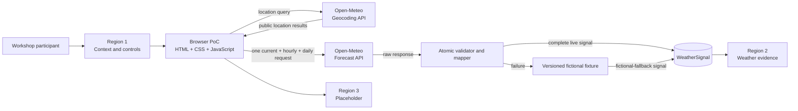
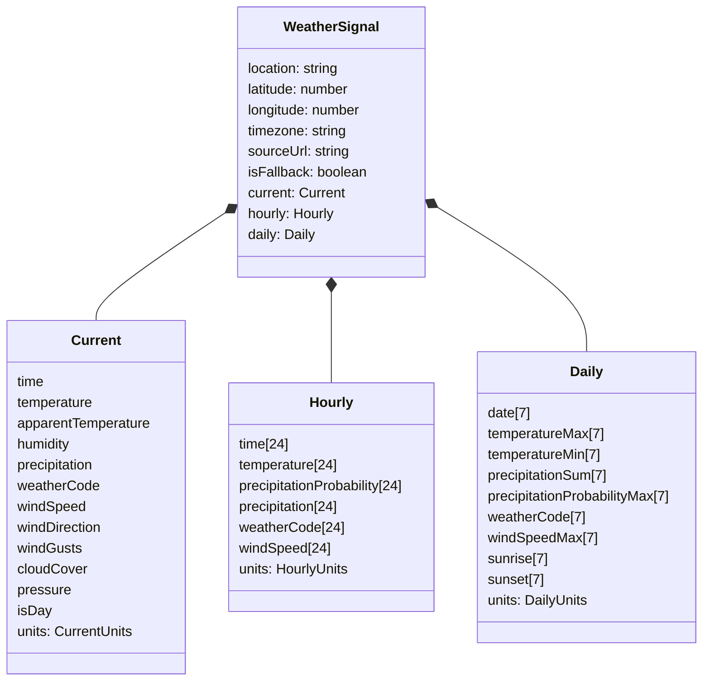
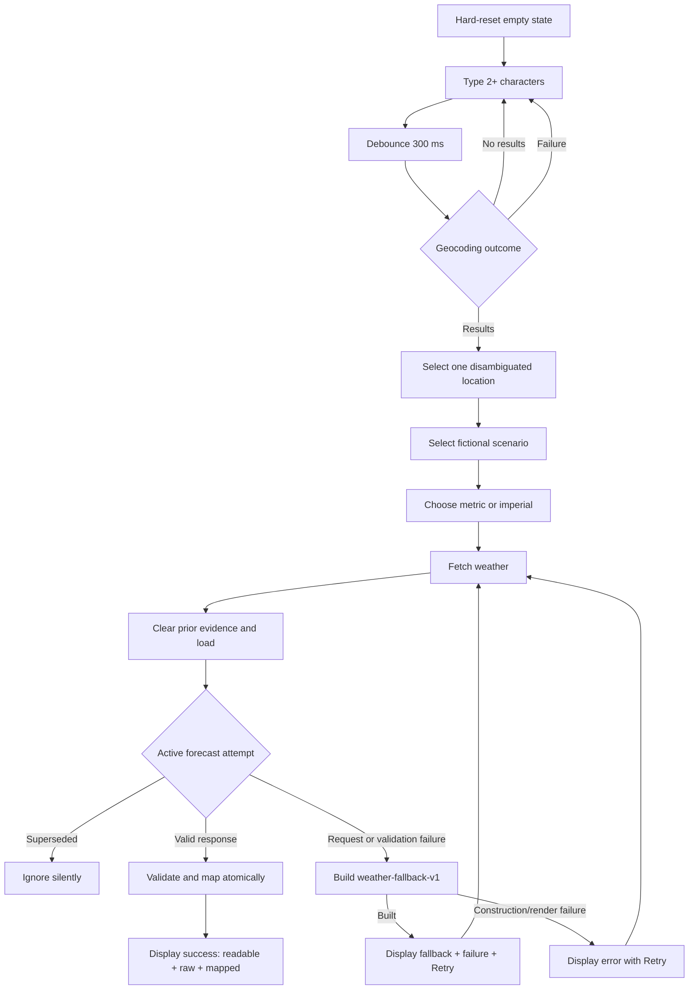

# Weather Workshop PoC Feature Specification v2

**Status:** APPROVED for weather-evidence MVP. Advisory remains blocked pending facilitator rule table.  
**Date:** 2026-07-21  
**Phase:** Regions 1 and 2 implemented; Region 3 placeholder only  
**Source decisions:** `brief_v2.md`, `glossary_v2.md`, and `adr_v2.md`

## Problem statement

Workshop participants need a small, inspectable example of turning an untrusted public API payload into a bounded application contract. Without an explicit evidence boundary, a browser demo can blur raw provider data, normalized values, fictional fallback, and locally derived advisory text, teaching unsafe architecture habits.

This disposable proof of concept lets a participant practice location search, weather retrieval, atomic validation, mapping, provenance, failure handling, and accessible presentation without creating approved architecture or an operational tool.

## Goal

Demonstrate that public Open-Meteo data can be fetched in a browser, atomically validated, mapped into a complete and provenance-carrying `WeatherSignal`, and inspected in readable, raw, and mapped forms while live evidence, fictional fallback, and fictional advisory remain unambiguous.

## Target users

### Primary: workshop participant

Uses and implements the PoC to practice an agent-assisted architecture workflow. The participant self-checks functionality, failure paths, accessibility, responsiveness, and conformance to this specification.

### Reviewer: workshop facilitator

Accepts scope, terminology, provenance, fallback semantics, `WeatherSignal` mapping, and the eventual advisory rule table. The facilitator is the only authority that may supply or approve advisory thresholds, precedence, and output copy.

No operational planner, approver, customer, supplier, or autonomous agent is a user of this phase.

## Success metrics

This phase has no analytics, deployment, adoption, retention, or revenue measurement. Success is a review outcome:

| Metric | Target | Evidence |
| --- | --- | --- |
| Required acceptance checks | 100% pass | Participant self-check matrix |
| Provenance-label defects | 0 | Facilitator review of live, failed-live, and fallback views |
| Contract-validation defects in supplied test cases | 0 | Automated mapping tests |
| Keyboard and status-announcement checks | 100% pass | Manual keyboard check and repository verifier |
| 320-pixel layout checks | 100% pass with no page-level horizontal overflow | Manual browser check at 320px width |
| Scope and safety acceptance | Facilitator accepts | Recorded facilitator review |

The weather-evidence MVP is accepted when all P0 checks pass. Advisory is a separately gated Later phase; its rule table does not block weather-evidence acceptance.

## Constraints

- Plain HTML, CSS, and JavaScript; no application framework.
- No backend, database, authentication, analytics, persistence, service worker, or deployment work.
- No runtime third-party or CDN libraries.
- Open-Meteo geocoding and forecast APIs are the only remote sources.
- `node:test` may test pure modules loaded via `require()`. No Playwright, no npm dependencies, no package manifest. Browser checks are manual or use the repository verifier.
- Reload is a hard reset. Application state is held only in page memory.
- Every control has an accessible name, keyboard focus is visible, and changing status is announced.
- The page works from 320 CSS pixels upward without page-level horizontal scrolling.
- Only fictional operational scenarios and facilitator-approved advisory rules may be used.
- No real internal, customer, supplier, warehouse, or delivery data may appear.

## System context



## User stories

### Workshop participant

- As a participant, I want to search and explicitly select a disambiguated public location so that the forecast coordinates are reviewable.
- As a participant, I want to choose a fictional operational scenario and unit system so that I can inspect bounded presentation variants.
- As a participant, I want one action to retrieve current, hourly, and daily weather so that all evidence shares one request context.
- As a participant, I want to compare readable weather, the exact raw response, and the mapped object so that I can see the architecture boundary.
- As a participant, I want failures and fictional fallback to remain visibly distinct from success so that I cannot mistake invented values for live evidence.
- As a keyboard user, I want to complete the full flow and hear status changes so that the exercise is operable without a pointer or visual-only cues.
- As a participant, I want reload to clear the exercise so that stale or restored evidence cannot be confused with a new attempt.

### Workshop facilitator

- As a facilitator, I want an atomic and explicit `WeatherSignal` so that contract correctness is objectively reviewable.
- As a facilitator, I want provenance carried in the mapped object and visible UI so that live and fictional values remain distinguishable.
- As a facilitator, I want advisory behavior blocked until I approve its rule table so that workshop copy does not acquire accidental operational authority.

## Functional requirements

### P0: Region 1, context and controls

**FR-1 Location query.** A labeled combobox accepts public place text. After at least two trimmed characters and 300 ms without input, it requests at most five Open-Meteo geocoding results.

Acceptance criteria:

- A newer location query aborts or supersedes the older request.
- A superseded request cannot update suggestions, announce failure, or affect weather evidence.
- Empty or one-character queries make no request and clear suggestions.
- Network, HTTP, and JSON failures produce a named search error without fallback weather.
- Zero results produce an announced empty result state.

**FR-2 Selected location.** Forecast fetch requires explicit selection of one suggestion showing name, available first-level administrative area, and country. Free text is never silently resolved to the first match.

Acceptance criteria:

- Selection stores geocoding ID when present, coordinates, country, optional `admin1`, and timezone when present.
- Editing the location query after selection invalidates the selected location.
- A missing or invalid geocoding timezone is retained as missing; fallback then uses UTC and discloses `UTC fallback because geocoding timezone was unavailable` in provenance/UI.

**FR-3 Scenario.** The participant explicitly selects `warehouse-planning` or `delivery-planning`; neither is selected on hard reset. The scenario is not used in the weather-evidence MVP (it's for the advisory phase).

**FR-4 Fetch weather.** The only weather command is Fetch weather. It is disabled until a selected location exists and while the active attempt is loading.

### P0: Open-Meteo forecast request

**FR-5 Single request.** One Forecast API request obtains all current, hourly, and daily variables for the selected coordinates with `timezone=auto` and `forecast_days=7`.

Current variables: temperature, apparent temperature, relative humidity, precipitation, weather code, wind speed, wind direction, wind gusts, cloud cover, surface pressure, and is day.

Hourly variables: temperature, precipitation probability, precipitation, weather code, and wind speed.

Daily variables: maximum/minimum temperature, precipitation sum, maximum precipitation probability, weather code, maximum wind speed, sunrise, and sunset.

```mermaid
sequenceDiagram
    actor P as Participant
    participant B as Browser
    participant G as Open-Meteo Geocoding
    participant F as Open-Meteo Forecast
    participant M as Validator/Mapper

    P->>B: Type location query
    B->>G: GET search (after 300 ms)
    G-->>B: Up to 5 public location results
    P->>B: Select location, scenario, units
    P->>B: Fetch weather
    B->>B: Clear prior evidence; enter loading
    B->>F: GET current + hourly + daily
    alt HTTP and payload valid
        F-->>B: Raw JSON response
        B->>M: Validate and map atomically
        M-->>B: Live WeatherSignal
        B-->>P: Success; show three evidence views
    else Non-abort request or mapping failure
        F-->>B: Error or invalid payload
        B->>M: Build weather-fallback-v1
        M-->>B: Fictional-fallback WeatherSignal
        B-->>P: Fallback + failure context + Retry
    else Superseded request
        B->>B: Ignore silently
    end
```

### P0: WeatherSignal contract

**FR-6 Contract boundary.** A `WeatherSignal` is a plain JavaScript object with shared provenance fields at the top and three nested sections: `current`, `hourly`, and `daily`. Advisory text never enters the contract.



Shared field requirements:

- `location` is a display string: "Name, Admin1, Country" (omitting absent admin1).
- `latitude` and `longitude` are finite numbers from the selected geocoding result.
- `timezone` is the Open-Meteo IANA timezone string (or "auto" if not yet resolved).
- `sourceUrl` is the exact credential-free forecast URL for live signals, or `bundled://fictional-weather-signal` for fallback.
- `isFallback` is `false` for live and `true` for fallback.

Section requirements:

- Current contains one complete record and a unit entry for every field.
- Hourly contains exactly 24 index-aligned entries beginning at or after the selected location's current local hour.
- Daily contains exactly seven index-aligned local dates.
- Codes use `WMO weather interpretation code`; `isDay` uses `1` (day) or `0` (night).
- Field names use camelCase: `temperature`, `apparentTemperature`, `humidity`, `precipitation`, `weatherCode`, `windSpeed`, `windDirection`, `windGusts`, `cloudCover`, `pressure`, `isDay` (current); `temperature`, `precipitationProbability`, `precipitation`, `weatherCode`, `windSpeed` (hourly); `temperatureMax`, `temperatureMin`, `precipitationSum`, `precipitationProbabilityMax`, `weatherCode`, `windSpeedMax`, `sunrise`, `sunset` (daily).
- Each section has its own `units` object with one unit string per field.

**FR-7 Atomic validation.** Mapping rejects the whole live response when any required block, field, unit, cardinality, timestamp, or alignment is invalid.

Rejection conditions include HTTP failure, JSON failure, missing values, `null`, non-finite numbers, out-of-range coordinates, `is_day` outside `0|1`, malformed or unordered timestamps, unknown units, unequal arrays, fewer than 24 eligible hourly entries, or fewer than seven daily entries. The mapper does not repair live values with fixture values, emit a partial signal, or silently drop rows.

### P0: Region 2, evidence and states

**FR-8 Distinct views.** Region 2 provides:

1. Readable weather with current conditions, 24 hourly entries, seven daily entries, provenance, and a separate advisory area.
2. Raw response, collapsed by default and rendered as inert pretty-printed text.
3. Mapped object, collapsed by default and rendered as inert pretty-printed text.

The representations describe the same active attempt. A fixture is never presented as an Open-Meteo raw response.

**FR-9 Visible states.** Region 2 has mutually exclusive empty, loading, success, fallback, and error-with-retry states.

- Empty shows no sample evidence.
- Loading clears prior evidence immediately and announces progress.
- Success requires a complete live `WeatherSignal`.
- Fallback shows fictional evidence, the live failure explanation, and Retry without success styling/language.
- Error with retry appears only when fallback construction/rendering also fails.
- Retry starts a new active attempt from current controls.
- A late superseded response never overwrites the active attempt.

**FR-10 Fallback fixture.** The fallback `WeatherSignal` has fixed fictional values with `isFallback` set to `true` and `sourceUrl` set to `bundled://fictional-weather-signal`. The fixed location is `Workshop Harbor, Fictional Coast`. It uses the same `current`/`hourly`/`daily` shape as the live signal. Given the same fixture version, it always emits the same object.

Visible fallback copy must state, without requiring expansion:

- **Fictional fallback data**.
- The live fetch failed.
- The values are a workshop example and are not actual weather for the selected place.
- Retry live weather.

If a payload was received but rejected, Raw response may show it only as **Failed live response**. If no payload arrived, Raw response says no response payload was received.

### P1: Advisory safety gate (separately gated — not part of weather-evidence MVP)

**FR-12 Fictional advisory.** The selected scenario reserves a separately labeled advisory output derived from `WeatherSignal`; it is not evidence and is not part of `WeatherSignal`.

The label is **Fictional workshop advisory — not operational guidance** and includes the rule-set version. Advisory text may summarize considerations but cannot approve, schedule, stop, dispatch, reroute, escalate, or act.

This phase emits no advisory. A later phase will implement advisory after the facilitator supplies and approves a complete rule table covering thresholds, precedence, exact copy, both unit systems, and fallback evidence. Until then, the advisory area states that facilitator-approved rules are unavailable and emits no weather-derived advice. This is a Later item, not a blocker for the weather-evidence MVP.

### P0: Region 3 placeholder

**FR-12 Reserved region.** Region 3 is visibly labeled **Reserved for a future workshop phase** and has no controls, data flow, advisory, or hidden behavior.

### P0: Accessibility and responsiveness

**FR-13 Accessibility.** All controls and view switchers have accessible names. Search follows the combobox/listbox keyboard pattern. Native elements are preferred. Focus remains visible. A polite live region announces search and weather status; urgent failures use one non-duplicated alert. Loading and evidence mode use text and not color alone. Expandable views expose expanded state.

**FR-14 Responsive layout.** From 320 CSS pixels upward, the page has no page-level horizontal overflow. Long place names and timestamps wrap; JSON may scroll only within its bounded viewer. Motion is nonessential and respects reduced motion.

### P0: Stateless lifecycle

**FR-15 Hard reset.** Reload restores an empty location query and selection, no scenario, empty evidence, no advisory, no status/retry context, and default collapsed views. The app uses no web storage, cookies, IndexedDB, service worker, URL restoration, or application cache.

## User flow



## Nice-to-have requirements (P1)

None. The phase is intentionally bounded; useful additions belong in a separately approved phase rather than a fast-follow list.

## Future considerations (P2)

- Region 3 behavior, only after a separate specification and ADR.
- Any persistence or stale-evidence behavior, only after defining retention and restored provenance.
- Any consumer beyond this page, only after versioning and compatibility policy for `WeatherSignal`.
- Any real advisory use, only after domain, legal, safety, and operational review.

These are not implementation commitments.

## Safety boundaries

- Live means a response passed local validation; it does not mean real-time, authoritative, provider-certified, or guaranteed accurate.
- Fallback is always a failure state and carries `isFallback: true` and `sourceUrl: bundled://fictional-weather-signal`.
- A selected real place is display context for fallback, not the source of fictional values.
- The app never fabricates a raw provider response.
- Advisory is separate from evidence and has no operational authority.
- No real internal or operational data enters the app.
- No autonomous approval or action exists.

## Non-goals

- Production architecture, reliability commitments, security certification, deployment, or monitoring.
- Backend, database, authentication, analytics, persistence, saved places, or history.
- Offline live weather, polling, background refresh, push alerts, maps, or device location.
- Real warehouse/delivery planning, customer/supplier workflows, approvals, or integrations.
- Partial best-effort mapping or silent fallback presented as live success.
- Region 3 implementation.

## Failure-path acceptance matrix

| Path | Expected result |
| --- | --- |
| Geocoding network/HTTP/JSON failure | Search error only; no weather fallback |
| Geocoding no results | Announced empty suggestions; fetch remains disabled |
| Geocoding race | Only latest query updates suggestions |
| Forecast network/HTTP/JSON failure | Fictional fallback + failure context + Retry |
| Required live field missing/null/non-finite | Whole live response rejected; fallback |
| Current timestamp invalid | Whole live response rejected; fallback |
| Hourly/daily arrays misaligned or short | Whole live response rejected; fallback |
| Required unit unknown/missing | Whole live response rejected; fallback |
| Older forecast resolves late | Ignored silently |
| New fetch starts | Prior evidence cleared immediately |
| Rejected payload exists | May appear only as Failed live response |
| No payload exists | Raw view states no response payload was received |
| Fixture construction/render fails | Error with Retry; no evidence shown |
| Reload | Hard-reset empty state |
| Advisory rules absent | No derived advice; advisory area states rules unavailable |

## Open questions and dependencies

### Non-blocking (Later phase)

- **Facilitator:** Supply and approve the versioned advisory rule table. This blocks a future advisory phase, not the weather-evidence MVP.

### Non-blocking implementation choices

- **Participant/design:** Choose tabs, a segmented control, or another accessible switcher for the three evidence views, provided all FR-9 and FR-14 behavior remains intact.
- **Participant/design:** Choose visual styling consistent with the workshop, provided evidence modes remain textually distinct and responsive requirements pass.

## Timeline and phasing

There is no production deadline or release. Implement this phase in ordered, independently testable slices: shell and state; geocoding; contract mapping; forecast orchestration; fallback; evidence views; browser accessibility/responsiveness. Advisory is a Later phase, gated on facilitator rule-table approval.
